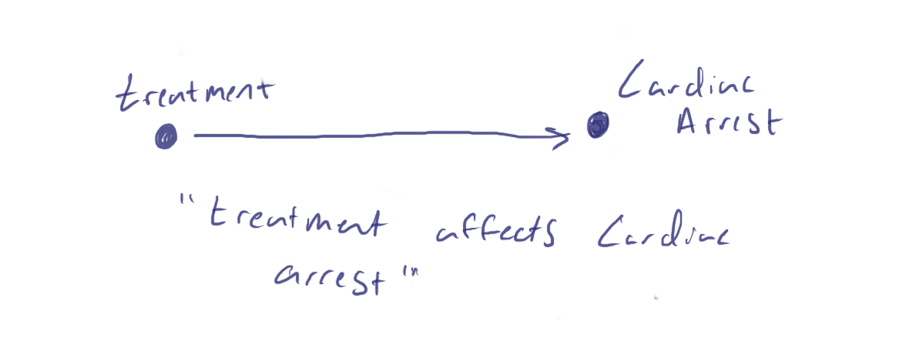
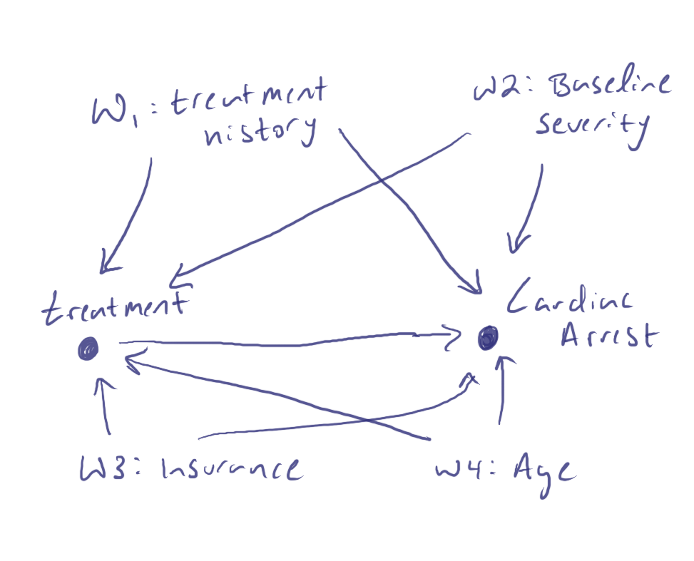

```{r setup, include=FALSE}
knitr::opts_chunk$set(echo = TRUE, warning = FALSE, message = FALSE)

library(simcausal)
library(ranger)
library(tidyverse)
library(ggdag)
library(MatchIt)
library(WeightIt)
library(survey)
library(tableone)
library(cobalt)   
library(PSweight)  
library(tmle)
library(DoubleML)
library(mlr3)
library(mlr3learners)
set.seed(12345)
```

Confounding [bias][hoverbias] is one of the most ubiquitous challenges in estimating effects from observational (real-world data) studies. Confounding happens when the relationship between a treatment (or other exposure) and an outcome is distorted by the presence of other variables. These confounding variables can create misleading associations, or biases, making it difficult to infer causal relationships accurately. These confounding variables can create misleading associations, making it difficult to infer causal relationships accurately. Fortunately for us, study design and statistical methods have been evolving to help us mitigate this bias and recover the [true effect estimate][effectshover] (when conditions are favorable: we'll touch on these, but point to better sources for a deeper dive).

Confounding bias^[Bias is a systematic error in the design or execution of a study that can lead to incorrect estimates of the association between exposure and health outcomes.] is one of the most ubiquitous challenges in estimating effects from observational (real-world data) studies. Fortunately, study design and statistical methods have been evolving to help us mitigate biases and recover the true effect estimate. In this article, we will introduce the concepts of confounding and bias, external control arm study design, target trial emulation. At the end of the example, you should have a general understanding of the benefits and shortcomings of traditional methods for estimating treatment effect, including propensity score matching and weighting, and g-computation, as well as modern methods, including targeted maximum likelihood estimating (TMLE). For the worked example, we will consider a scenario where the protective effect of a treatment against heart attacks is obscured by confounding. This is a common and reproducible type of problem in public health.

# Directed Acyclic Graphs

Causal graphs, specifically Directed Acyclic Graphs (DAGs), are powerful tools used in epidemiology (and other fields) to visualize and understand the relationships between variables in a study. A DAG is a graphical representation where nodes represent variables, and directed edges (unidirectional arrows) indicate causal relationships between these variables. The "acyclic" aspect means that there are no loops or cycles, ensuring that the graph represents a unidirectional flow of causality.

DAGs are particularly useful for identifying confounding because they clearly depict the pathways through which variables are connected. Confounders are variables that influence both the treatment and the outcome, potentially creating a spurious association. By mapping out all relevant variables and their relationships, a DAG helps researchers see which variables need to be controlled for in order to obtain an unbiased estimate of the treatment effect.

```{r DAG0, echo=FALSE, fig.cap='Figure 1: Causal diagram - directed acyclic graph (DAG) where nodes are variables and arrows indicated directional causal relationships. Example of simple DAG where treatment affects (causes or influences) cardiac arrest.', out.width = '90%'}

```

For example, let us consider a pseudo-real-life example: treatment A (taking the medication Axyza) is believed to reduce cholesterol. In our simpolified DAG, we represent this with two nodes: "treatment with Axyza" and "cholesterol," with an arrow pointing from "treatment with Axyza" to "cholesterol," indicating the causal relationship. 

Now, let's think a little more about the relationship between this treatment and outcome - let's say we know patients with previously high cholesterol are much more likely to be treated and that this prior level strongly influences subsequent levels. Additionally, age and gender are suspected to be be related to both treatment and outcome in our example. We say that these additional variables (confounders) influence both likelihood of receiving treatment and risk of having a heart attack.

We add those nodes and corresponding directed edges into our diagram. Our DAG can now guide us in adjusting for confounders through propensity scores, TMLE, or other statistical methods, so we can better isolate the true effect of the treatment.

Our plausible DAG:

```{r DAG1, echo=FALSE, fig.cap='Figure 2: DAG of working example where treatment affects cardiac events, but with 4 confounding variables', out.width = '90%'}

```

***

# Real World Data Study Design {.tabset .tabset-fade .tabset-pills}

## External Control Arms

text tk

***

## Observational Data and the `target trial`

Unlike randomized controlled trials (RCTs), where random assignment of treatment ensures that treatment groups are comparable, observational studies must rely on study design and statistical techniques to account for differences between treated and untreated groups.

One approach to estimating causal effects in observational studies is to emulate the conditions of a target randomized trial as closely as possible. This process, often referred to as “target trial emulation,” involves designing the observational study to mimic the hypothetical RCT that would answer the causal question of interest.

***

# Effects Estimates {.tabset .tabset-fade .tabset-pills}

## Crude (Naive) Estimates 

This is simple the apparent difference in means between treatment groups, ignoring all else. You can also think of this as the conditional mean difference: $$E[cholesterol|statin=1]-E[cholesterol|statin=0]$$

***

## Propensity Scores {.tabset }

Propensity scores represent the probability that someone (e.g., a patient) receives a treatment given a set of observed covariates. The concept was introduced by Rosenbaum and Rubin in 1983, and provides an elegant and intuitive way to balance the distribution of covariates between treated and control groups. Historically, propensity scores have been a powerful tool in causal inference, used to control for confounding variables in observational studies.

### Calculating a Propensity Score 

A propensity score is the conditional probability of receiving a treatment given a set of observed covariates. Mathematically, it is defined as:

$$ e(X) = P(T = 1 | X) $$

where $T$ is the treatment indicator (1 for treated, 0 for control), and $X$ represents the observed covariates.

***

### Propensity Scores for Matching

Propensity score matching involves pairing treated and control units with similar propensity scores. This technique aims to create a pseudo-randomized experiment by ensuring that the distribution of covariates is similar between the matched groups. Matching can significantly reduce selection bias, allowing for more accurate estimation of treatment effects. One related concept is that of *cohort imbalance*, which we're hoping to remedy by this method.

***

### Propensity Scores for Weighting

Propensity score weighting involves assigning *weights* to each person based on their propensity score to create a *synthetic* (standardized) sample in which the distribution of covariates is balanced across treatment groups. The two common approaches are:

1.  **Inverse Probability of Treatment Weighting (IPTW):** Each treated unit is weighted by the inverse of their propensity score, and each control unit is weighted by the inverse of one minus their propensity score. This method can be expressed as:

    $$ w_i = \frac{T_i}{e(X_i)} + \frac{1 - T_i}{1 - e(X_i)} $$

2.  **Stabilized Weights:** To prevent extreme weights that can lead to high variance, stabilized weights are used:

    $$ w_i = \frac{T_i}{e(X_i)} \times \frac{P(T = 1)}{P(T = 1 | X)} + \frac{1 - T_i}{1 - e(X_i)} \times \frac{P(T = 0)}{P(T = 0 | X)} $$

***

### Limitations

Note: There is considerable debate as to whether to use propensity scores for matching [(See King et. al. 2019)][kingetal] and we also tend to lean away from recommending this method, although it is very intuitive and tractable. Also, note that through this method we are estimating a variant of the average treatment effect: the *average treatment effect among the treated* (ATT).

***

## G-Computation {.tabset }

G-computation, also known as the G-formula or G-estimation, is a very promising method also used to estimate the (unbiased) causal effect of a treatment or intervention.

### What is G-Computation?

G-computation involves using a statistical model to predict outcomes under different treatment scenarios. The key idea is to estimate what each individual's outcome would be under each possible treatment condition (even though we only observe them under one condition in reality). So we're using the observed data plus a statistical model to estimate counterfactual outcomes, and then using these counterfactual outcomes (providing a way to understand the causal effect of treatments)themselves) to estimate treatmnet effects.

***

### How G-Computation Works

1.  **Modeling the Outcome:** First, a model is fitted to predict the outcome $Y$ based on the treatment $T$ and a set of covariates $X$. This model can be a regression model or it can be any machine learning model that can generate predicted outcomes!

    $$ \widehat{Y} = f(T, X)  $$

2.  **Predicting Counterfactuals:** Using the fitted model, predict the outcomes for each individual under different treatment scenarios. Specifically, predict the outcome for each individual if they had received the treatment and if they had not received the treatment.

    $$ \widehat{Y}(T=1, X=x) $$ and $$ \widehat{Y}(T=0, X=x) $$

3.  **Averaging the Predictions:** Calculate the average of the predicted outcomes for the treated and control scenarios across all individuals in the sample.

$$ \text{ATE} = \frac{1}{N} \sum_{i=1}^{N} \left[ \widehat{Y_i}(T=1) - \widehat{Y_i}(T=0) \right] $$

***

### Estimating the Unseen Version of Each Person

The essence of g-computation lies in its ability to estimate the "unseen" or counterfactual version of each person. For each individual in the study, g-computation estimates what their outcome would have been if they had received a different treatment than the one they actually received. This is done using the statistical model trained on the observed data:

-   **Counterfactual for Treated Individuals:** For individuals who received the treatment ($T=1$), g-computation predicts what their outcome would have been if they had not received the treatment ($T=0$).
-   **Counterfactual for Control Individuals:** Conversely, for individuals who did not receive the treatment ($T=0$), it predicts what their outcome would have been if they had received the treatment ($T=1$).

By doing this for all individuals, g-computation fills in the missing potential outcomes under both treatment conditions, allowing for the estimation of causal effects. This approach also accounts for confounding factors and provides a very good estimate of the average treatment effect (ATE).

***

## Modern/Emerging Methods: TMLE {.tabset }

### What is TMLE?

Targeted Maximum Likelihood Estimation (tmle) and the broader statistical approach of Targeted Learning is perhaps the most promising method to be applied to real world data in recent times. It tends to be the best statistical method for a given study design for *washing out* bias by using a substitution estimator approach (starting with a g-computation estimator and deriving a fluctuation parameter from the propensity score and something called the `clever covariate`)

```{r tmle, echo=FALSE, fig.cap='Figure 3: TMLE takes the same form as g-computation, but the red stars indicate an updated Q(1) and Q(0).', out.width = '90%'}
knitr::include_graphics("tmle.png")
```

"A second chance to get it right" using the components we've introduced!

See van der Laan and Rose (2011) for an excellent full course on Targeted Learning.

***

### How TMLE Works

1.  **Initial Estimation:** Start with an initial estimate of the outcome model (similar to g-computation) and the propensity score model (IPTW).

2.  **Clever Covariate:** Construct a "clever covariate," which is derived from the propensity score. The clever covariate helps target the estimator towards the parameter of interest, making the estimate more efficient.

    $$ H(T, X) = \frac{T}{e(X)} - \frac{1 - T}{1 - e(X)} $$

3.  **Fluctuation Parameter:** Incorporate a fluctuation parameter to adjust the initial estimate. This is done through a process called targeting, where the initial model is updated to reduce bias and improve efficiency.

4.  **Targeted Estimate:** Combine the updated outcome model and the clever covariate to obtain the targeted estimate of the treatment effect. This final estimate is designed to be both unbiased and efficient.

***

### Advantages of TMLE

-   **Double Robustness:** TMLE provides valid estimates even if either the outcome model or the propensity score model is misspecified, but not both.
-   **Efficiency:** By incorporating the clever covariate and the fluctuation parameter, TMLE achieves higher efficiency compared to traditional methods.
-   **Robustness to Model Misspecification:** TMLE's targeted update step helps mitigate bias due to model misspecification, leading to more reliable causal inference.

***

# Worked Example

In this demonstration, we'll:

1)  Create (plausible) synthetic data so that we can know the ground truth effect we're trying to estimate,
2)  Estimate the effect without any attempt to remedy confounding (to start with our baseline **biased** estimate),
3)  Apply traditional (propensity scores and g-computation) and modern (TMLE and DML) statistical methods to recover the unbiased effect and compare these.

Let's dive in!

## Libraries for today's R session

All the following libraries are available via CRAN and can be installed either through the `tools` menu or using `install.packages(" ")` command for each.

```{r}
library(simcausal)
library(ranger)
library(tidyverse)
library(ggdag)
library(MatchIt)
library(WeightIt)
library(survey)
library(tableone)
library(cobalt)   
library(PSweight)  
library(tmle)
library(DoubleML)
library(mlr3)
library(mlr3learners)
set.seed(12345)
```

## Synthetic Data and Ground Truth

When we generate synthetic data, we have complete control over the data-generating process. This means we know the true causal effect of the treatment, allowing us to directly assess the accuracy and bias of our estimates.

By applying causal inference methods to synthetic data, we can evaluate their performance in recovering the known causal effect (as well as identifying and quantifying bias (we'll define $bias = true-estimated$)).

### DAG-based data generation process

We're going to use a package called `simcausal` to create a hypothetical DAG and simulate data (directly) from that. A more traditional approach is to build up the nodes sequentially (see box 1 in <https://onlinelibrary.wiley.com/doi/epdf/10.1002/sim.7628> for example)

```{r}
D_AW <- DAG.empty() + 
  node("age", distr = "rnorm", mean = 50, sd = 10) +
        node("gender", distr = "rbern", prob = 0.5) +
       node("priorchol", distr = "rnorm", mean = 200 + 0.5 * age, sd = 30) +
        node("statin", distr = "rbern", prob = plogis(-2 + 0.02 * priorchol + 0.01 * age - 0.5 * gender)) +
        node("cholesterol", distr = "rnorm", mean = 180 - 20 * statin + 0.8 * priorchol + 0.5 * age + 5 * gender, sd = 15)

D_AW_set <- set.DAG(D_AW)
```


<!-- Let's look at our DAG (notice interesting configuration of counterfactuals and outcome) -->

```{r}

plotDAG(D_AW_set, xjitter = 0.3, yjitter = 0.3)

```

### Generate synthetic data

Now let's generate some data (let's start with n = 5000)

```{r}
ObsData <- sim(DAG = D_AW_set, n = 5000, rndseed = 12345)
head(ObsData)
```


```{r}

A1 <- node("statin", distr = "rbern", prob = 1)
D_AW_set <- D_AW_set + action("A1", nodes = A1)
A0 <- node("statin", distr = "rbern", prob = 0)
D_AW_set <- D_AW_set + action("A0", nodes = A0)

Xdat1 <- sim(DAG = D_AW_set, actions = c("A1", "A0"), n = 5000, rndseed = 12345)

Y1 <- Xdat1[["A1"]][,"cholesterol" ]
Y0 <- Xdat1[["A0"]][,"cholesterol" ]

(True_ATE <- mean(Y1 - Y0))

```


Notice we have created the *full* dataset! We have the usually unavalable Y(1) and Y(0) as well as observed Y.

## Bias

Now let's take a look at the *apparent* (naive) estimate of average treatment effect: $\widehat{ATE}$ = $\widehat{\psi}$ = E[Y\|A=1] - E[Y\|A=0]).

We'll compare this to the *true* ATE: ψ = E[Y(1)] - E[Y(0)]. (note we can only do this latter step because we have generated Y(1) and Y(0))

[Think "*conditional* A" vs. "*do* A."]

```{r}
treat <- ObsData %>% filter(statin == 1) %>% select(cholesterol) 
controls <- ObsData %>% filter(statin == 0) %>% select(cholesterol) 

(naive_est <- mean(treat$cholesterol) - mean(controls$cholesterol))

(True_ATE <- mean(Y1 - Y0))

# Absolute bias
(bias <- naive_est - True_ATE)

# Percent bias
(naive_est-True_ATE)/True_ATE*100
```

We define percent **bias** as:

 $$\% bias =\frac{\widehat{\psi} - \psi }{\psi} * 100\%$$  

So our bias in the above example is `r round((naive_est-True_ATE)/True_ATE*100,4)`%.

An estimator is said to be unbiased if its bias is zero.

In our simulation experiments we'll define the bias of an estimator as expected (or mean) difference between estimator and true value.

## Traditional methods

All right. Let's get down to business removing this bias and getting the estimate we *would have gotten* from a (target) randomized trial. We'll apply 4 ( + naive) methods to remove bias:

1)  naive estimate with no adjustment
2)  propensity score (matching and weighting)
3)  g-computation
4)  targeted maximum likelihood (tmle)
5)  double machine learning (dml)

### No methods at all (aka crude (naive) estimate)

It's good to plant our flag and see how bad it is if we don't do anything about bias (you'll see we just recover the initial biased estimate, but it should help level-set).

```{r}
naive <- glm(cholesterol ~ statin, data = ObsData)
summary(naive)

```

As we can see, we get the biased estimate by regression (statin coefficient = `r round(naive$coefficients["statin"],4)`)

So our initial percent bias from simple (unadjusted) regression is `r round((naive$coefficients["statin"]-True_ATE)/True_ATE*100,2)`%.


### Using Propensity Scores for Matching

We'll use the `tableone` package:

Remember, we identified age, gender and prior cholesterol as potential confounders.

```{r}
xvars<-c("age","gender","priorchol")
```

```{r}
table1<- CreateTableOne(vars=xvars, strata="statin", data=ObsData )
## include standardized mean difference (SMD)
print(table1, smd=TRUE)
```

Wow – dramatic difference in gender and prior-cholesterol. A typical metric is the standardized mean difference (SMD) and a heuristic for balance is a SMD \<0.1.

```{r}
propensity_model <- matchit(statin ~ age + gender + priorchol, 
                    data = ObsData, 
                    method = "nearest", # computationally efficient
                    ratio = 1, 
                    caliper = 0.05)
bal.tab(propensity_model, m.threshold=0.1)
```


#### Examine matching triage

```{r}
print(plot(propensity_model, type = 'jitter'))
```

We notice we're now pretty balanced (but lost some friends along the way - for this analysis, we'd be dropping all the *unmatched* people.)

#### Extract matches and analyze:

```{r}
md <- match.data(propensity_model)
```

```{r}
adjusted.PSmatch <- glm(cholesterol ~ statin,
                        data = md, 
                        weights = weights)

summary(adjusted.PSmatch)

```

You'll notice now we're closer to the *true* value (`r round(adjusted.PSmatch$coefficients["statin"], 4)` vs true value = `r round(True_ATE, 4)`).

#### Using Propensity Scores for Weighting

Let's use the `WeightIt` package to recalculate weights (both non-stabilized and stabilized).

```{r}
# Calculating non-stabilized weights
w.out.ns <- weightit(cholesterol ~ age + gender + priorchol, data = ObsData, method = "ps", estimand = "ATE")
summary(w.out.ns)

# Adding weights to data
ObsData$weights_ns <- w.out.ns$weights
```

And again for stabilized weights:

```{r}
# Calculating stabilized weights
w.out.st <- weightit(cholesterol ~ age + gender + priorchol, data = ObsData, method = "ps", estimand = "ATE", stabilize = TRUE)
summary(w.out.st)

# Adding weights to data
ObsData$weights_st <- w.out.st$weights
```

```{r}
# Creating survey design objects
design_ns <- svydesign(ids = ~1, weights = ~weights_ns, data = ObsData)
design_st <- svydesign(ids = ~1, weights = ~weights_st, data = ObsData)

# Estimating ATE using non-stabilized weights
ate_ns <- svyglm(cholesterol ~ statin, design = design_ns)
summary(ate_ns)

# Estimating ATE using stabilized weights
ate_st <- svyglm(cholesterol ~ statin, design = design_st)
summary(ate_st)
```

nice - both of these coefficients are  close to the `true` value.

### G-Computation

We can use the `SuperLearner` package to calculate expected outcomes and then set treatment to 0 and 1 for each individual to generate $\widehat{Y_i}(T=0)$ and $\widehat{Y_i}(T=1)$ (which we'll call Q_0 and Q_1).

```{r}
# Define Super Learner libraries
sl_libs <- c("SL.glmnet", "SL.ranger", "SL.glm")
# Select relevant variables from the dataset
Obs <- ObsData %>% dplyr::select(statin, cholesterol,age, gender, priorchol)
# Extract outcome and covariates
Y <- Obs$cholesterol
W_A <- Obs %>% dplyr::select(-cholesterol) 
# Step 1: Outcome regression using Super Learner
Q <- SuperLearner(Y = Y,  
                  X = W_A,  
                  SL.library = sl_libs)


Q_A <- as.vector(predict(Q)$pred)

# Predict Q for treated (A = 1) and untreated (A = 0)
W_A1 <- W_A %>% mutate(statin = 1)  # Set A = 1
Q_1 <- as.vector(predict(Q, newdata = W_A1)$pred)

W_A0 <- W_A %>% mutate(statin = 0) # Set A = 0
Q_0 <- as.vector(predict(Q, newdata = W_A0)$pred)

# Create dataset for g-computation
dat_g.comp <- as.data.frame(cbind(Y = Obs$cholesterol, A = Obs$statin, Q_A, Q_0, Q_1))
```

Now the g-computation estimate of the ATE is simply the average difference of Q_1 - Q_0:

```{r}
(ate_gcomp <- mean(dat_g.comp$Q_1 - dat_g.comp$Q_0))
```

Very nice!

## Modern/emerging methods

### TMLE

We'll recalculate the propensity score again (this time also using an ensemble machine learning approach (SuperLearning)) and then use the g-computation we applied previously:

-   Step 1: Estimate the outcome:

Done. This is the g-computation step.

-   Step 2a: Estimate the propensity score:

```{r}
# Propensity score estimation using Super Learner
A <- Obs$statin
W <- Obs %>% dplyr::select(-cholesterol, -statin)
g <- SuperLearner(Y = A,  
                  X = W,  
                  family=binomial(),  
                  SL.library=sl_libs)
g_w <- as.vector(predict(g)$pred)
```

-   Step 2b: Estimate the clever covariate

```{r}

H_1 <- 1/g_w

H_0 <- -1/(1-g_w) 

# add clever covariate data to previous dataset we made
dat_tmle <- 
  dat_g.comp %>%
  bind_cols(
    H_1 = H_1,
    H_0 = H_0) %>%
  mutate(H_A = case_when(A == 1 ~ H_1,   # if A is 1 (treated), assign H_1
                         A == 0 ~ H_0))  # if A is 0 (not treated), assign H_0
```

-   Step 3: Estimate the Fluctuation Parameter

```{r}
glm_fit <- glm(Y ~ -1 + offset(Q_A) + H_A, 
               data=dat_tmle)

(eps <- coef(glm_fit))
```

-   Step 4: Update the Initial Estimates of the Expected Outcome

```{r}
dat_tmle<- dat_tmle %>% 
 mutate(Q_A_update = Q_A + eps*H_A,
        Q_1_update = Q_1 + eps*H_1,
        Q_0_update = Q_0 + eps*H_0) 
  
```

-   Step 5: Compute the Statistical Estimand of Interest

```{r}
(tmle_ate <- mean(dat_tmle$Q_1_update - dat_tmle$Q_0_update))  
```

*Chef's Kiss*

Of course, there is a one-stop-shop package to calculate TMLE

```{r}
tmle_fit <- tmle(Y = Y, A = A, W = W,
                 Q.SL.library = sl_libs,
                 g.SL.library = sl_libs) 
  
tmle_fit
```

```{r}
tmle_fit$estimates$ATE$psi
```

# Double machine learning

Another promising technique for controlling for confounding variables using machine learning methods is Double Machine Learning (DML). 

The core idea of DML is to leverage machine learning algorithms to flexibly model and control for confounders while isolating the effect of the treatment variable on the outcome. The core steps of the DML algorithm are: 

1) **Prediction:** Predict the outcome variable $Y$ and the treatment variable $D$ using covariates $Z$ by estimating $E[Y|Z]$ and $E[D|Z]$. This can be done using machine learning methods such as Random Forest or other high-performing ML tools (we use random forests in our worked example)

2) **Residualization (Orthogonalization):** Compute the residuals $W = Y - E[Y|Z]$ and $V = D - E[D|Z]$. This step is similar to the Frisch-Waugh-Lovell procedure briefly outlined below.

3) **Regression:** Regress $W$ on $V$ to estimate the target parameter $\psi$. 

The Key Ingredients of DML are:

* Neyman orthogonality
* High-quality ML estimation
* Sample splitting

See Chernozhukov, et. al., 2018 for the excellent, but highly-technical paper.


```{r}
obj_dml_data = DoubleMLData$new(Obs, y_col = "cholesterol", d_cols = "statin")


lgr::get_logger("mlr3")$set_threshold("warn")
# Initialize a random forests learner with specified parameters
ml_l = lrn("regr.ranger", num.trees = 100, mtry = 2, min.node.size = 2,
           max.depth = 5)
ml_m = lrn("regr.ranger", num.trees = 100, mtry = 2, min.node.size = 2,
           max.depth = 5)
ml_g = lrn("regr.ranger", num.trees = 100, mtry = 2, min.node.size = 2,
           max.depth = 5)


doubleml_plr = DoubleMLPLR$new(obj_dml_data,
                               ml_l, ml_m, ml_g,
                               n_folds = 2,
                               score = "IV-type")


doubleml_plr$fit()
doubleml_plr$summary()
```


# Everything together:

```{r}
plot(c(1,2,3,4,5,6), c(naive$coefficients["statin"], 
                 adjusted.PSmatch$coefficients["statin"],
                 ate_ns$coefficients["statin"],
                 ate_gcomp, 
                 tmle_fit$estimates$ATE$psi, 
                 doubleml_plr$coef),
     ylim = c(-5,-25), 
     ylab = "parameter estimate", 
     xlab = "method",
     axes = F, lwd = 2)
axis(1, at = c(1,2,3,4, 5,6), labels = c("crude", "PS-match.", "PS-weight."," G-comp", "TMLE", "DML"))
axis(2)
abline(h = True_ATE, lty = 2, lwd = 2, col = "grey")
text(2, .26, "grey line = 'true value'")
```

## Bonus: prettier DAGs and adjusting with `ggdag` package

```{r}
theme_set(theme_dag())

D_AW_DAG <- dagify(Y ~  A + W1 + W2 + W3 ,
                   A ~ W1 + W2 + W3,
                   W3 ~ W1,
                   labels = c("Y" = "Cholesterol", 
                              "A" = "Statins",
                              "W1" = "Age",
                              "W2" = "Gender",
                              "W3" = "Prior Cholesterol"),
                   exposure = "A",
                   outcome = "Y")
ggdag(D_AW_DAG, text = TRUE, use_labels = "label")
```

Look at options here:

<https://cran.r-project.org/web/packages/ggdag/ggdag.pdf>

### Example: adjust for W1

```{r}
# control_for(D_AW_DAG, var = "W1")
ggdag_adjust(D_AW_DAG, var = "W3")
```


# Bonus Frisch-Waugh-Lovell (FWL) 

## 1. Regress A (T) on W (X)

```{r}
a.hat <- glm(statin ~  age + gender + priorchol, data = ObsData)
```


## 2. Regress Y on W (X)

```{r}
y.hat <- glm(cholesterol ~  age + gender + priorchol, data = ObsData)
```


## 3. Compute residuals from regressions 1 & 2. 

```{r}
delta.a <- a.hat$residuals
delta.y <- y.hat$residuals
```


## 4. Regress residuals delta.y on residuals delta.a

```{r}
Delta <- glm(delta.y ~ delta.a)

Delta$coefficients["delta.a"]
```

Voila


***

# References

1.  Rosenbaum, P. R., & Rubin, D. B. (1983). ["The central role of the propensity score in observational studies for causal effects."][rosenbaumeta] *Biometrika*, 70(1), 41-55.
2.  Austin, P. C. (2011). ["An introduction to propensity score methods for reducing the effects of confounding in observational studies."][austin] *Multivariate Behavioral Research*, 46(3), 399-424.
3.  van der Laan, M. J., & Rose, S. (2011). ["Targeted Learning: Causal Inference for Observational and Experimental Data."][vanderlaan] Springer.
4. Chernozhukov, V., Chetverikov, D., Demirer, M., Duflo, E., Hansen, C., Newey, W., & Robins, J. (2018). ["Double/debiased machine learning for treatment and structural parameters."][Chernozhukov] The Econometrics Journal, 21(1), C1-C68., https://doi.org/10.1111/ectj.12097

## Suggested Reading


[kingetal]: <https://gking.harvard.edu/publications/why-propensity-scores-should-not-be-used-formatching> "King, G., & Nielsen, R. 2019. 'Why Propensity Scores Should Not Be Used for Matching,' Political Analysis, 27(4), 435-454: 'We show that propensity score matching (PSM), an enormously popular method of preprocessing data for causal inference, often accomplishes the opposite of its intended goal --- thus increasing imbalance, inefficiency, model dependence, and bias. The weakness of PSM comes from its attempts to approximate a completely randomized experiment, rather than, as with other matching methods, a more efficient fully blocked randomized experiment...'"
[rosenbaumeta]: <https://academic.oup.com/biomet/article/70/1/41/240879> "Rosenbaum, P. R., & Rubin, D. B. (1983). 'The central role of the propensity score in observational studies for causal effects,' Biometrika, 70(1), 41-55: 'The propensity score is the conditional probability of assignment to a particular treatment given a vector of observed covariates. Both large and small sample theory show that adjustment for the scalar propensity score is sufficient to remove bias due to all observed covariates...'"
[austin]: <https://www.ncbi.nlm.nih.gov/pmc/articles/PMC3144483/> "Austin, P. C. (2011). 'An Introduction to Propensity Score Methods for Reducing the Effects of Confounding in Observational Studies,' 46(3), 399-424: 'The propensity score is the probability of treatment assignment conditional on observed baseline characteristics. The propensity score allows one to design and analyze an observational (nonrandomized) study so that it mimics some of the particular characteristics of a randomized controlled trial...'"
[vanderlaan]: <https://ctml.berkeley.edu/publications/targeted-learning-causal-inference-observational-and-experimental-data-0> "van der Laan, M. J., & Rose, S. (2011). 'Targeted Learning: Causal Inference for Observational and Experimental Data.' Springer: 'The statistics profession is at a unique point in history. The need for valid statistical tools is greater than ever; data sets are massive, often measuring hundreds of thousands of measurements for a single subject. The field is ready to move towards clear objective benchmarks under which tools can be evaluated. Targeted learning allows (1) the full generalization and utilization of cross-validation as an estimator selection tool so that the subjective choices made by humans are now made by the machine, and (2) targeting the fitting of the probability distribution of the data toward the target parameter representing the scientific question of interest...'"
[hoverbias]: ## "Bias is a systematic error in the design or execution of a study that can lead to incorrect estimates of the association between exposure and health outcomes."
[effectshover]: <https://www.ncbi.nlm.nih.gov/pmc/articles/PMC2652882/> "For an overview of effects measures in RWD studies, see: Hernán, M.A., & Robins, J.M. (2006). 'Estimating causal effects from epidemiological data.' J Epidemiol Community Health. 60(7), 578-86: In ideal randomised experiments, association is causation: association measures can be interpreted as effect measures because randomisation ensures that the exposed and the unexposed are exchangeable. On the other hand, in observational studies, association is not generally causation: association measures cannot be interpreted as effect measures because the exposed and the unexposed are not generally exchangeable. However, observational research is often the only alternative for causal inference. This article reviews a condition that permits the estimation of causal effects from observational data, and two methods—standardisation and inverse probability weighting—to estimate population causal effects under that condition. For simplicity, the main description is restricted to dichotomous variables and assumes that no random error attributable to sampling variability exists. The appendix provides a generalisation of inverse probability weighting."
[Chernozhukov]: <https://academic.oup.com/ectj/article/21/1/C1/5056401> "Double Machine Learning (DML) is a statistical technique designed to estimate causal effects while controlling for confounding variables using machine learning methods. It addresses the challenges posed by high-dimensional data, where traditional methods may fail to accurately estimate causal parameters due to overfitting and model complexity.
The core idea of DML is to leverage machine learning algorithms to flexibly model and control for confounders while isolating the effect of the treatment variable on the outcome."
