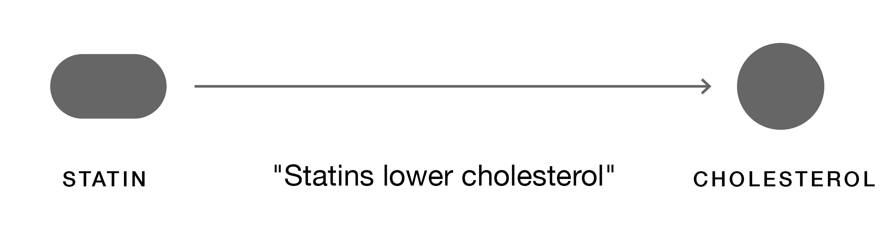
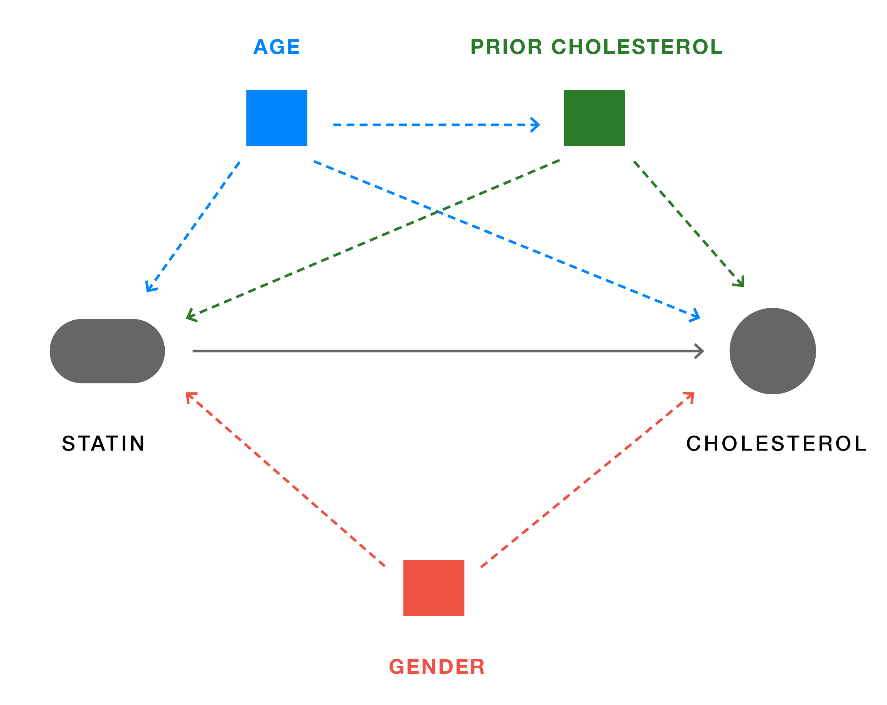

```{r setup, include=FALSE}
knitr::opts_chunk$set(echo = TRUE, warning = FALSE, message = FALSE)

library(simcausal)
library(ranger)
library(tidyverse)
library(ggdag)
library(MatchIt)
library(WeightIt)
library(survey)
library(tableone)
library(cobalt)   
library(PSweight)  
library(tmle)
library(DoubleML)
library(mlr3)
library(mlr3learners)
set.seed(12345)
```

## Introduction {.tabset .tabset-fade .tabset-pills}

> In theory there is no difference between theory and practice. In practice there is.\
> **Yogi Berra**

Confounding bias is one of the most ubiquitous challenges in estimating effects from observational (real-world data) studies. Confounding occurs when the relationship between a treatment (or other exposure) and an outcome is distorted by the presence of other variables. These confounding variables can create misleading associations, or biases, making it difficult to infer causal relationships accurately. Fortunately, study design and statistical methods have been evolving to help us mitigate biases and recover the true [treatment effect estimate](https://www.ncbi.nlm.nih.gov/pmc/articles/PMC2836213/ "Treatment effect estimates quantify the impact of treatment on outcomes of interest. While this article is intended to give an overview of practical causal methods to readers from diverse backgrounds, if you are new to causal inference, we recommend the overview by Judea Pearl, linked here.").

In this article, we will explore the concepts of confounding, bias, causal identifiability, and target trial emulation. We will then provide an overview of causal graphs before introducing traditional and modern (or emerging) applied methods for estimating effects from data, including targeted learning, targeted maximum likelihood estimation (TMLE), and double machine learning (DML). By the end, you should have a general understanding of the benefits and shortcomings of traditional and emerging methods for estimating treatment effects, as well as how we (can) draw causal conclusions from data.

------------------------------------------------------------------------

### How to read this article

In order to offer a meaningful experience for readers across multiple fields, we have made use of tabs to separate conceptual overviews, notation, and a worked example in R. If you would like to learn the concepts but do not intend to apply these methods, proceed by reading linearly. If you would like to see how these methods work in practice, use the **Notation** and **Worked example** tabs.

We have also provided additional resources for key terms from the field that may not be familiar to all readers. Hover over a hyperlink to see a definition, and use the hyperlinks to navigate to more in-depth background materials.[^1]

[^1]: Note on accessibility: This is the authors' first time using these formatting conventions in RMarkdown. If you are experiencing difficulty reading the article due to compatibility with assistive technologies, or for any other reasons, please reach out to the authors. We would be happy to provide you with an alternate format, and will incorporate feedback into future iterations of the work.

------------------------------------------------------------------------

### Notation conventions

Some notation conventions we use:

-   $A$ or $T$ to denote treatment variables.
-   $W$ or $X$ to denote covariates or sets of confounders.

However, it's important to note that $w$ will sometimes be used for weights, particularly when describing propensity score weights and other related weights.

In this article, we will adopt some common notations from different authors who tend not to strictly adhere to conventions. Given that our sources and references use slightly varying notations, we will be flexible in our approach. We aim to be clear about the conventions being used in each section to avoid any confusion. This flexible notation approach allows us to integrate insights from the different sources while maintaining coherence in our explanations.

Our primary goal is clarity and ease of understanding for the reader, even if this means diverging slightly from standardized notation.

------------------------------------------------------------------------

### Worked example

In this demonstration, we'll:

1)  create (plausible) synthetic data so that we can know the ground truth treatment effect we're trying to estimate;
2)  estimate the treatment effect without any attempt to remedy confounding (which will allow us to establish our baseline *biased* estimate); and
3)  apply and compare traditional (propensity scores, g-computation) and emerging (TMLE, DML) statistical methods to recover the unbiased effect.

We will be using an example scenario where the protective effect of statins (treatment) against high cholesterol (outcome) is obscured by confounding. Though we will be working with synthetic data in our example, this is a common and reproducible type of problem in public health.

------------------------------------------------------------------------

### Libraries for today's R session

All the following libraries are available via [CRAN](https://cran.r-project.org/ "The Comprehensive R Archive Network (CRAN)") and can be installed either through the `tools` menu in `RStudio`, or by using the `install.packages(" ")` command.

```{r}
library(simcausal)
library(ranger)
library(tidyverse)
library(ggdag)
library(MatchIt)
library(WeightIt)
library(survey)
library(tableone)
library(cobalt)   
library(PSweight)  
library(tmle)
library(DoubleML)
library(mlr3)
library(mlr3learners)
set.seed(12345)
nn = 5000 #Simulation(s) sample size
```

------------------------------------------------------------------------

## Potential outcome framework {.tabset .tabset-fade .tabset-pills}

### Overview

The potential outcome framework, also known as the Neyman-Rubin causal model, is a formal approach to causal inference. It defines the causal effect of a treatment by comparing *potential outcomes* under different treatment conditions. Imagine each individual (or unit) as having two potential outcomes: one if they receive the treatment and another if they don't. In reality, we can only observe one of these outcomes (*the observed outcome*) – the other one remains unpicked, floating up in heaven.

The key concepts of the potential outcome framework are:

-   **Potential outcomes** [$Y_i(1) \text{, } Y_i(0)$]: The two theoretical, possible outcomes for an individual, depending on whether or not the individual receives treatment.
-   **Observed outcome:** The one true outcome observed in reality, which depends on the actual treatment received.
-   **Causal effect:** On an individual-level, defined as the difference between the two potential outcomes.

Since we cannot observe both potential outcomes for the same individual simultaneously, estimating causal effects involves dealing with the *missing* potential outcomes. We often refer to this inability to observe both outcomes as the **fundamental problem of causal inference**.

------------------------------------------------------------------------

### Estimating missing potential outcomes

Various methods are used to estimate missing potential outcomes (and thus causal effects). Increasingly, researchers leverage machine learning methods to calculate potential outcomes. One example of this entails using ensemble *super learners*. Two examples of methods that use super learners to estimate potential outcomes are [synthetic controls](%5Bhttps://medium.com/@nasdag/using-synthetic-control-methods-for-causal-inference-a-step-by-step-guide-7bbcb4f49e2f "Synthetic controls are a family of techniques that approximate potential outcomes to estimate causal effect. As we will not discuss these methods in depth in this article, see Dagher (2023) 'Using Synthetic Control Methods for Causal Inference: A Step-by-Step Guide' for an overview of synthetic controls.'") and *G-computation* (discussed in depth later in this article).

In **synthetic controls** (as well as other methods), super learners work by:

-   Constructing a synthetic control group by combining multiple control units to approximate the treated unit's pre-treatment characteristics.
-   Estimating $Y_i(0)$ for the treated individuals and $Y_i(1)$ for the control group.

In **G-computation**, super learners work by:

-   Using a statistical model to predict potential outcomes based on treatment and covariates.
-   Simulating potential outcomes for each individual by modeling the expected outcome given covariates and treatment.
-   Averaging these predictions to estimate causal effects.

------------------------------------------------------------------------

### Notation

**Potential outcomes** for an individual (or unit) $i$ are represented by:

$$Y_i(1) \text{,  } Y_i(0)$$

where $Y_i(1)$ is the outcome if the individual receives the treatment, and $Y_i(0)$ is the outcome if the individual does not receive the treatment (i.e., the control).

The **observed outcome** is represented by:

$$
Y_i = Y_i(1) \text{, or } Y_i = Y_i(0)
$$

depending on whether or not the individual received treatment.

**Causal effect** is defined as:

$$
\Delta_i = Y_i(1) - Y_i(0)
$$

------------------------------------------------------------------------

## The target trial and causal interpretations {.tabset .tabset-fade .tabset-pills}

### Overview

Randomized controlled trials (RCTs) are considered the gold standard in clinical research because random assignment of treatment ensures that treatment groups are comparable (both across observed and unobserved covariates). Note that this isn't a free ride to causal estimation, and, perhaps surprisingly, RCTs, like any other real world study, generate data with missing counterfactual outcomes - however, randomization ensures that those missing values are due to chance. 


Unlike in randomized controlled trials (RCTs), where random assignment of treatment ensures that treatment groups are comparable, observational studies rely on study design and statistical techniques to account for differences between treated and untreated groups. One approach to estimating causal effects in observational studies is to emulate the conditions of a target randomized trial as closely as possible. This process, often referred to as [target trial emulation](https://journals.lww.com/jasn/fulltext/2023/08000/target_trial_emulation_to_improve_causal_inference.5.aspx "For a deeper dive into target trial emulation, see Fu (2023) 'Target Trial Emulation to Improve Causal Inference from Observational Data: What, Why, and How?'."), involves designing the observational study to mimic the hypothetical RCT that would answer the causal question of interest.

Regardless of whether the data set is derived from RCTs or observational studies, we establish the *legitimacy* of our causal claims by satisfying [causal identifiability assumptions](https://www.hsph.harvard.edu/miguel-hernan/wp-content/uploads/sites/1268/2024/01/hernanrobins_WhatIf_2jan24.pdf "Causal identifiability assumptions provide the set of conditions that allow us to estimate effects measures. For a more in-depth exploration of causal identifiability assumptions, see chapter three in Hernán and Robins (2010), Causal Inference: What If"). These are, briefly:

-   **Exchangeability:** Treated and untreated groups are comparable (in terms of both observed and unobserved confounders).
-   **Positivity:** Each subject has a positive probability of receiving each treatment (given their covariates).
-   **Consistency:** Potential outcomes are consistent with observed treatment. (In other words, the potential outcomes of a possible treatment are the same as the actual outcomes that would be observed if the treatment were assigned.)
-   **No interference (aka, single unit treatment):** The treatment of one subject does not affect the outcome of another subject.

The nature of RCTs, when designed properly, inherently ensures that identifiability conditions are met. In observational studies, the task of meeting these conditions is not always so obvious. Target trial emulation provides an entry into thinking through this problem: If you could design a randomized-control trial to emulate your observational data, what would that study look like?

------------------------------------------------------------------------

### **Identifiability assumptions**

**Exchangeability** *(treated and untreated groups are comparable)* is represented as:

$$Y(t) \perp\!\!\!\perp T \mid W$$ where the potential outcome $Y(t)$ is independent of the treatment $T$ given the covariates $W$.

**Positivity** *(each subject has a positive probability of receiving each treatment)* is defined as:

$$P(T = t \mid W = w) > 0$$ for all treatment levels $t$ and covariates $w$. (In other words, there should be no combination of covariates for which a treatment probability is zero.)

**Consistency** *(potential outcomes are consistent with observed treatment)* is represented as:

$$Y = Y(t) \text{  if  } T = t$$

where a subject who received treatment $t$ has an observed outcome $Y(t)$.

**No Interference** *(the treatment of one subject does not affect the outcome of another subject)* is represented as:

$$Y_i(t) \text{ not affected by } T_j \text{ for } i \neq j$$.

or, in other words, the potential outcome $Y_i(t)$ of subject $i$ is only affected by their own treatment $T_i$, not by the treatment of any other subject $T_j$.

------------------------------------------------------------------------

## Directed acyclic graphs {.tabset .tabset-fade .tabset-pills}

### Overview

Causal graphs, specifically directed acyclic graphs (DAGs), are powerful tools used in epidemiology (and other fields) to visualize relationships between variables in a study. These graphs help researchers understand causal pathways and identify potential confounders that could bias study results.

A DAG is a graphical representation where nodes represent variables, and directed edges (unidirectional arrows) indicate causal relationships between these variables. The "acyclic" aspect means that there are no loops or cycles, ensuring a unidirectional flow of causality. Figure 1 shows a simple DAG where the only variables modeled are treatment (statins) and outcome (high cholesterol).

------------------------------------------------------------------------

```{r DAG0, echo=FALSE, fig.cap='Figure 1: Example of a simple DAG where treatment (statins) affects (causes or influences) outcome (cholestoral).', out.width = '60%'}

```

------------------------------------------------------------------------

DAGs are particularly useful for identifying confounding because they clearly depict the pathways through which variables are connected. Confounders (or *confounding variables*) are variables that influence both the treatment and the outcome, potentially creating a spurious association. By mapping out all relevant variables and their relationships, a DAG helps researchers see which variables need to be controlled for to obtain an unbiased estimate of the treatment effect.

To better understand the relationship between treatment and outcome, let's consider a more complex model. Say we know patients with previously high cholesterol are much more likely to be treated with statins and that this prior cholesterol level strongly influences subsequent levels. Additionally, we suspect that age and gender are related to both treatment and outcome. We say that these additional variables (confounders) influence both the likelihood of receiving treatment and the risk of having high cholesterol. We incorporate these additional variables (confounders) into our diagram, adding corresponding nodes and directed edges (see figure 2).

DAGs like this can guide our analysis by identifying where we need to adjust for confounders. This allows us to better isolate the true treatment effect (through methods like propensity scores or TMLE).

------------------------------------------------------------------------

```{r DAG1, echo=FALSE, fig.cap='Figure 2: Example of a DAG where treatment (statins) affects outcome (cholestoral), and three confounding variables (age, prior cholestoral, gender) affect both treatment and outcome.', out.width = '60%'}

```

------------------------------------------------------------------------

### Worked example: Generating synthetic data

**Synthetic data and ground truth**

This worked example will use simulated (or synthetic) data. Simulated studies, which use pseudo-randomly generated data that closely resembles real-world data, are commonly used to observe and test methods because they allow complete control over the data-generating process. This means we know the true causal effect of the treatment, which allows us to directly assess the accuracy and bias of our estimates. By applying causal inference methods to synthetic data, we can evaluate their performance in recovering the known causal effect (as well as the identifying and quantifying biases).

**DAG-based data generation process**

We're going to use a package called `simcausal` to create a hypothetical DAG and (directly) from that. (A more traditional approach is to build up the nodes sequentially, [see box 1 in the linked tutorial](https://onlinelibrary.wiley.com/doi/epdf/10.1002/sim.7628 "For an example of creating simulated data by sequentially building up nodes, see box 1 in this tutorial for TMLE by Luque‐Fernandez et al.").)

```{r}
D_AW <- DAG.empty() + 
  node("age", distr = "rnorm", mean = 50, sd = 10) +
        node("gender", distr = "rbern", prob = 0.5) +
       node("priorchol", distr = "rnorm", mean = 200 + 0.5 * age, sd = 30) +
        node("statin", distr = "rbern", prob = plogis(-2 + 0.02 * priorchol + 0.01 * age - 0.5 * gender)) +
        node("cholesterol", distr = "rnorm", mean = 180 - 20 * statin + 0.8 * priorchol + 0.5 * age + 5 * gender, sd = 15)

D_AW_set <- set.DAG(D_AW)
```

Notice the value we put in above: `- 20 * statin` $\rightarrow$ this is where we seed in our causal effect that we'll later recover.

Using `plotDAG`, let's take a look at the resulting DAG. Notice the interesting configuration of treatment, outcome, and confounders here.

```{r}

plotDAG(D_AW_set, xjitter = 0.3, yjitter = 0.3)

```

**Generate synthetic data**

Using this DAG, let's now generate some data, starting with n = 5000.

```{r}
ObsData <- sim(DAG = D_AW_set, n = nn, rndseed = 12345)
head(ObsData)
```

```{r}

A1 <- node("statin", distr = "rbern", prob = 1)
D_AW_set <- D_AW_set + action("A1", nodes = A1)
A0 <- node("statin", distr = "rbern", prob = 0)
D_AW_set <- D_AW_set + action("A0", nodes = A0)

Xdat1 <- sim(DAG = D_AW_set, actions = c("A1", "A0"), n = nn, rndseed = 12345)

Y1 <- Xdat1[["A1"]][,"cholesterol" ]
Y0 <- Xdat1[["A0"]][,"cholesterol" ]

(True_ATE <- mean(Y1 - Y0))

```

Notice we have created the *full* dataset! We have the (usually unavailable) Y(1) and Y(0) as well as the observed Y.

------------------------------------------------------------------------

### Prettier DAGs with `ggdag`

Notice that the DAG produced in our worked example included lines crashing on the labels and compressed type. For more stylish (and accessible) DAGs generated in R, consider using the `ggdag` package:

```{r}
theme_set(theme_dag())

D_AW_DAG <- dagify(Y ~  A + W1 + W2 + W3 ,
                   A ~ W1 + W2 + W3,
                   W3 ~ W1,
                   labels = c("Y" = "Cholesterol", 
                              "A" = "Statins",
                              "W1" = "Age",
                              "W2" = "Gender",
                              "W3" = "Prior Cholesterol"),
                   exposure = "A",
                   outcome = "Y")
ggdag(D_AW_DAG, text = TRUE, use_labels = "label")
```

The package offers a range of styles and controls, available in [the reference PDF](https://cran.r-project.org/web/packages/ggdag/ggdag.pdf "See style options for the ggdag package here."). We can also use `ddag` to control for particular variables. In the example below, we adjust for "W3".

```{r}
# control_for(D_AW_DAG, var = "W3")
ggdag_adjust(D_AW_DAG, var = "W3")
```

------------------------------------------------------------------------

### DAGitty

If you are looking for a tool as you begin to model confounders and variables, [DAGitty](https://www.dagitty.net/) is an excellent online resource that helps researchers create and analyze DAGs. It provides a user-friendly interface to draw DAGs and automatically identifies the necessary adjustments to control for confounding variables. DAGitty can also check for d-separation, a criterion used to determine if a set of variables blocks all backdoor paths, ensuring valid causal inference.

------------------------------------------------------------------------

## Bias and average treatment effect {.tabset .tabset-fade .tabset-pills}

### Overview

Bias, a fundamental concern in causal inference, refers to systematic errors (e.g., confounders) that distort the relationship between variables, potentially leading to incorrect conclusions about causality. Bias represents the difference between the actual and the estimated causal effects. An estimator is said to be *unbiased* if its bias is zero.

In order to understand bias in a data set, we can compare the *apparent* (naive) estimate of [average treatment effect](https://www.stat.cmu.edu/~larry/=sml/Causation.pdf "A positive treatment effect implies treatment is associated with higher risk of the outcome, while a negative treatment effect implies treatment is associated with decreased risk of the outcome. If you are unfamiliar with the concept of average (mean) treatment effect, see the linked class notes for causal inference from Larry Wasserman at CMU.") (ATE) to the *true* ATE. The *naive* ATE is calculated by taking the difference between the observed risk of outcome in the treated group and the observed risk of outcome in the untreated group (without correcting for bias).

To calculate *true* ATE, we look instead at counterfactual outcomes. A counterfactual outcome represents the potential outcome for an unobserved treatment value. If an individual receives treatment in real life, their counterfactual outcome is the estimated outcome had they not received treatment.

The *true* ATE is calculated by taking the difference between risk of counterfactual outcome for the treated group versus the risk of counterfactual outcome for the untreated groups. By considering counterfactuals (calculated) rather than observed (actual) outcomes, we correct for bias.

In our worked example, we are able to calculate both *naive* and *true* ATE because we are using synthetic data that generates counterfactual outcomes. (In an actual study setting, you would not be able to so easily calculate *true* ATE (or bias) because you would not know the counterfactual outcomes.) These values offer us a benchmark to assess the efficacy of different causal methods.

------------------------------------------------------------------------

### Notation

The **apparent (naive) ATE** is defined as:

$$\widehat{ATE} = \widehat{\psi} = E[Y|A=1] - E[Y|A=0]$$ where $E[Y|A]$ represents the risk of outcome $Y$ given a treatment value $A$ (1 = treated, 0 = untreated).

The **true ATE** is defined as:

$$ATE = \psi = E[Y(1)] - E[Y(0)]$$

where $E[Y(i)]$ represents the risk of outcome $Y$ given counterfactual treatment $A = i$.

From the apparent (naive) ATE and the true ATE, **bias** can be defined as:

$$bias = ATE - \widehat{ATE} = \psi - \widehat{\psi}$$

where $\psi$ is the target parameter (in this case ATE).

**Percent bias** is defined here as:

$$\% \space bias =\frac{\widehat{\psi} - \psi }{\psi} * 100\%$$

------------------------------------------------------------------------

We want to pause and make an important distinction: $E[Y|A = 1] - E[Y|A = 0]$ is not necessarily equivalent to $E[Y(1)] - E[Y(0)]$. The former represents the difference of expected outcomes for *observed* treatments, which often includes a lot of bias due to confounding factors. The second represents the difference of expected outcomes for counterfactual treatments, representing the causal effect estimate ~ the answer to `what would have happened had we intervened`.

Handy guide to notation:

1. **Observed Outcomes Notation**: $E[Y|A = 1] - E[Y|A = 0]$ represents the expected difference in outcomes between the group that actually received the treatment ($A = 1$) and the group that did not ($A = 0$). This is susceptible to bias because the groups may differ in ways other than the treatment they received.

2. **Counterfactual Outcomes Notation**: $E[Y(1)] - E[Y(0)]$, also denoted as $E[Y|do(A = 1)] - E[Y|do(A = 0)]$, represents the expected difference in outcomes if we could hypothetically assign the treatment ($A = 1$) or not ($A = 0$) to the same group of individuals. This is the causal effect we are interested in, as it reflects the true effect of the treatment after accounting for confounding.

3. **alt Counterfactual Outcomes Notation**: $E[Y^{a=1}] - E[Y^{a=0}]$, also represents the expected difference in outcomes under the counterfactual scenarios where the treatment is *assigned* ($a = 1$) or *not assigned* ($a = 0$).


Let's practice notation with an example of a (somewhat benevolent) CEO. She observes the happiness ($Y$) of her employees and how it relates to their *observed* salary ($A$), which can be either high ($A = 1$) or low ($A = 0$). Initially, she observes the happiness levels of employees based on their current salaries: $E[Y|A = 1]$ and $E[Y|A = 0]$. This observed difference, $E[Y|A = 1] - E[Y|A = 0]$, might include bias because employees with higher salaries might also have other advantages contributing to their happiness.


Now, suppose the CEO decides to *intervene*. She randomly selects a group of employees and increases their salaries to high ($A = 1$), while others remain at low salary ($A = 0$). By doing this, she creates a scenario where the assignment of high or low salary is random, akin to a randomized controlled trial.

In this intervention scenario, we are interested in the counterfactual outcomes: $E[Y(1)]$ (the expected happiness if all employees received high salaries) and $E[Y(0)]$ (the expected happiness if all employees received low salaries). The difference, $E[Y(1)] - E[Y(0)]$, represents the *causal* effect of high salary on happiness, free from confounding bias.

Notice in this scenario we'd still have to consider the identifiability assumptions to conclude whether our association would have a causal interpretation. 

------------------------------------------------------------------------

### Worked example

Let's take a look at the apparent (naive) estimate of average treatment effect in our cholesterol example. We will compare this to the *true* ATE – a value we can only calculate because our synthetic data generated Y(1) and Y(0).

```{r}
treat <- ObsData %>% filter(statin == 1) %>% select(cholesterol) 
controls <- ObsData %>% filter(statin == 0) %>% select(cholesterol) 

(naive_est <- mean(treat$cholesterol) - mean(controls$cholesterol))

(True_ATE <- mean(Y1 - Y0))

# Absolute bias
(bias <- naive_est - True_ATE)

# Percent bias
(naive_est-True_ATE)/True_ATE*100
```

So our bias in the above example is `r round((naive_est-True_ATE)/True_ATE*100,4)`%.

------------------------------------------------------------------------

## Traditional methods for effects estimates

## Crude (naive) estimates {.tabset .tabset-fade .tabset-pills}

### Overview

Crude (naive) estimates provide a basic understanding of the association between treatment and outcome (without correcting for bias) by evaluating the apparent difference in means between treatment groups, ignoring all else. You can also think of this as the *conditional mean difference*, without adjustment for covariates. Researchers almost always begin their analysis by calculating crude estimates to have as a benchmark. In our worked example, as we are dealing with synthetic data, you will notice that the crude estimate and the naive ATE are the same.

------------------------------------------------------------------------

### Notation

The **conditional mean difference** for our worked example is defined as:

$$CMD = E[cholesterol|statin=1]-E[cholesterol|statin=0]$$ It's helpful to think of how you would get this value from the data, and to think about what *conditioning* is and how it differs from *imposing* a condition. For now, think of conditioning as simply filtering. That is, think of the statement $E[cholesterol|statin=1]$ as the expected value (in this case, the mean) of cholesterol *where* statin treatment equals 1.

------------------------------------------------------------------------

### Worked example

All right. Let's get down to business removing this bias and getting the estimate we *would have gotten* from a (target) randomized trial. To begin, we will calculate the crude (naive) estimate, without adjustment. It's good to plant our flag and see how bad it is if we don't do anything about bias.

```{r}
naive <- glm(cholesterol ~ statin, data = ObsData)
summary(naive)

```

As we can see, by regression, we get get the same biased estimate (statin coefficient = `r round(naive$coefficients["statin"],4)`) that we calculated earlier via naive ATE. So, our initial percent bias from simple (unadjusted) regression is `r round((naive$coefficients["statin"]-True_ATE)/True_ATE*100,2)`% (the same value we calculated using $ATE$ and $\widehat{ATE}$).

------------------------------------------------------------------------

## Propensity scores {.tabset .tabset-fade .tabset-pills}

### Overview

Introduced by [Rosenbaum and Rubin in 1983](https://academic.oup.com/biomet/article/70/1/41/240879 "Rosenbaum and Rubin (1983). 'The central role of the propensity score in observational studies for causal effects.'"), propensity scores evaluate the conditional probability that someone (e.g., a patient) receives a treatment given a set of observed covariates. Historically, propensity scores have been a powerful tool used in observational studies to control for confounding variables. The concept provides an elegant and intuitive way to balance the distribution of covariates between treated and untreated (control) groups.

------------------------------------------------------------------------

### Notation

The propensity score is defined as:

$$ e(X) = P(T = 1 | X) $$

where $T$ represents the treatment indicator (1 for treated, 0 for untreated), and $X$ represents the set of observed covariates.

------------------------------------------------------------------------

## Propensity scores for matching {.tabset .tabset-fade .tabset-pills}

### Overview

Propensity score matching involves pairing units (individuals) between treated and control groups with similar propensity scores. This technique aims to create a pseudo-randomized experiment by ensuring a similar distribution of covariates between the two matched groups.

[Given the appropriate selection of covariates](https://www.ncbi.nlm.nih.gov/pmc/articles/PMC1513192/ "For a discussion of methods for better selecting covariates for propensity scores, see Brookhart et al (2007), 'Variable selection for propensity score models'."), matching can allow for more accurate estimation of treatment effects by significantly reducing [selection bias](https://www.ncbi.nlm.nih.gov/pmc/articles/PMC2780010/ "Selection bias in observational studies arises when a a selection of individuals from a population does not represent a random selection from the target population. See Hammer et al (2009) 'Avoiding Bias in Observational Studies' for further discussion.") and *cohort imbalance* (unequal distribution of covariates between treated and control groups). You can think of this as a kind of patient *match-finding* step for target trial emulation (i.e., finding patients that match in important characteristics).

While propensity score matching is an intuitive application and often sufficient for cohort balancing, contemporary debates question whether propensity scores should be used for matching [(see King et al, 2019)](https://gking.harvard.edu/publications/why-propensity-scores-should-not-be-used-formatching "King and Nielsen (2019) 'Why Propensity Scores Should Not Be Used for Matching.'"). Despite its intuitive appeal and practicality, we tend to lean away from recommending this method. (Note: the problems laid out for matching don't apply to propensity score *weighting*.)

------------------------------------------------------------------------

### Notation

In our worked example for propensity score matching, we will use a variant of the average treatment effect: the **average treatment effect among the treated** **(ATT)**. ATT is defined as:

$$ATT = E[Y(1) - Y(0)|T = 1]$$ where the difference between the counterfactual outcomes $Y(1)$ and $Y(0)$ are only compared within the treatment group $(T=1)$.

To quantify mean values of covariates across treatment groups, we will also use the **standard mean difference (SMD)**, defined as:

$$SMD = \frac{\widehat{X}(1)-\widehat{X}(0)}{s_p}$$

where $\widehat{X}(t)$ is the mean value of the covariate in the group $T=t$ and $s_p$ is the pooled standard deviation.

------------------------------------------------------------------------

### Worked example

Recall that when drawing our initial DAG, we identified three potential confounders: age, gender, and prior cholesterol. Let's use the `tableone` package to evaluate the standard mean difference (SMD) across treatment groups for each of these covariates:

```{r}
xvars<-c("age","gender","priorchol")
```

```{r}
table1<- CreateTableOne(vars=xvars, strata="statin", data=ObsData )
## include standardized mean difference (SMD)
print(table1, smd=TRUE)
```

Wow - look at the imbalance! (For reference, when evaluating distribution of covariates across treatment groups, a heuristic for balance is $SMD < 0.1$.)

Now, let's use `matchit` to apply propensity score matching:

```{r}
propensity_model <- matchit(statin ~ age + gender + priorchol, 
                    data = ObsData, 
                    method = "nearest", # computationally efficient
                    ratio = 1, 
                    caliper = 0.05)
bal.tab(propensity_model, m.threshold=0.1)
```

And we'll use `propensity model` to inspect the results:

```{r}
print(plot(propensity_model, type = 'jitter'))
```

You'll notice that our groups are now pretty well balanced, although we lost some friends along the way. (For this analysis, we dropped all the *unmatched* people.)

Let's extract the matches, so we can re-evaluate treatment effect in matched groups (using ATT):

```{r}
md <- match.data(propensity_model)
```

```{r}
adjusted.PSmatch <- glm(cholesterol ~ statin,
                        data = md, 
                        weights = weights)

summary(adjusted.PSmatch)

```

You'll notice that the effects estimate we calculated here is much to the *true* ATE we initially calculated (`r round(adjusted.PSmatch$coefficients["statin"], 4)` vs `r round(True_ATE, 4)`).

------------------------------------------------------------------------

## Propensity scores for weighting {.tabset .tabset-fade .tabset-pills}

### Overview

[Propensity score weighting](https://www.ncbi.nlm.nih.gov/pmc/articles/PMC8757413/ "For a more in-depth introduction to this method, see Chesnaye et al. (2022) 'An introduction to inverse probability of treatment weighting in observational research'") involves assigning weights to each individual based on their propensity score to create a synthetic (standardized) sample in which the distribution of covariates is balanced across treatment groups. The effect is that the apparent sample size of each group and the impact of each individual's outcome on the ATE will be weighted depending on propensity score.

The goal of propensity score weighting is to ensure balanced covariates across treatment groups without needing to lose any data (unlike in propensity score matching, where dropped unmatched individuals). In order to do so, we have to make individuals with less represented covariates count more than individuals with well-represented (or over-represented) covariates.

There are two methods commonly used for calculating propensity score weights: **inverse probability of treatment weighting (IPTW)** and **stabilized weights.** For both methods, each unit of the treated group is weighted by the inverse of their propensity score, and each unit of the control population is weighted by the inverse of one minus their propensity score.

Stabilized weights are used if any covariates are under- or over-represented in either treatment group, which causes disproportionate representation of individuals, leading to high variance in the propensity score weights. Stabilized weights are calculated with an additional factor: the marginal probability of treatment (a measure of the overall probability of receiving treatment across the entire study population).

------------------------------------------------------------------------

### Notation

Non-stabilized weights for traditional **inverse probability of treatment weighting (IPTW)** are expressed as:

$$ w_i = \frac{T_i}{e(X_i)} + \frac{1 - T_i}{1 - e(X_i)} $$

where $w_i$ represents weight, $T_i$ represents the treated individuals, $1-T_i$ represents the untreated individuals, and $e(X_i)$ represents propensity score.

**Stabilized weight** is expressed as:

$$ w_i = \frac{T_i}{e(X_i)} \times \frac{P(T = 1)}{P(T = 1 | X)} + \frac{1 - T_i}{1 - e(X_i)} \times \frac{P(T = 0)}{P(T = 0 | X)} $$

where $P(T=t)$ represents the marginal probability of treatment.

------------------------------------------------------------------------

### Worked example

Returning to our original data set, let's use the `WeightIt` package to recalculate weights. First we will calculate non-stabilized weights and apply them to the data:

```{r}
# Calculating non-stabilized weights
w.out.ns <- weightit(cholesterol ~ age + gender + priorchol, data = ObsData, method = "ps", estimand = "ATE", stabilize = FALSE)
summary(w.out.ns)

# Adding weights to data
ObsData$weights_ns <- w.out.ns$weights
```

And then again for stabilized weights:

```{r}
# Calculating stabilized weights
w.out.st <- weightit(cholesterol ~ age + gender + priorchol, data = ObsData, method = "ps", estimand = "ATE", stabilize = TRUE)
summary(w.out.st)

# Adding weights to data
ObsData$weights_st <- w.out.st$weights
```

Notice that at a glance these results appear the same. This is because for simplicity, we did not introduce pathological weighting to our synthetic data. Had we introduced extreme propensity scores (e.g., near 0), the non-stabilized and stabilized weights could have produced different values. It's useful to note that extreme weights are also a consideration when addressing the positivity identifiability assumption.

Now we will use `svydesign` to generate data for treated and control groups based on our weighted data, and from those groups, we will calculate ATE. First for non-stabilized weights:

```{r}
# Creating survey design objects
design_ns <- svydesign(ids = ~1, weights = ~weights_ns, data = ObsData)

# Estimating ATE using non-stabilized weights
ate_ns <- svyglm(cholesterol ~ statin, design = design_ns)
summary(ate_ns)
```

And again for stabilized weights:

```{r}
# Creating survey design objects
design_st <- svydesign(ids = ~1, weights = ~weights_st, data = ObsData)

# Estimating ATE using stabilized weights
ate_st <- svyglm(cholesterol ~ statin, design = design_st)
summary(ate_st)
```

Remember that the *true* treatment effect we calculated using $Y(0)$ and $Y(1)$ was `r round(True_ATE, 4)`. Both stabilized and non-stabilized weights get us very close to this ATE (`r round(ate_st$coefficients["statin"], 4)` and `r round(ate_ns$coefficients["statin"], 4)` respectively) - even closer than propensity score matching got us.

Propensity score weighting is quite common in practice in epidemiology and public health and, at the time we are writing this article, is probably the most ubiquitous method for causal inference from observational data.

------------------------------------------------------------------------

## G-computation {.tabset .tabset-fade .tabset-pills}

### Overview

Introduced by James Robins in 1986 to address the limitations of traditional causal effects estimates, particularly in longitudinal studies, g-computation (also known as the g-formula or g-estimation) is a very promising method used to estimate true treatment effect in complex settings where variables may vary over time.

[G-computation](https://www.ncbi.nlm.nih.gov/pmc/articles/PMC6074945/ "For a more in-depth introduction to g methods, see Naimi et al (2016) 'https://www.ncbi.nlm.nih.gov/pmc/articles/PMC6074945/'") involves using a statistical model to predict outcomes under different treatment scenarios. The key idea is to estimate what each individual's outcome would be under each possible treatment condition (counterfactual outcomes) even though we only actually observe them under one condition.

The essence of g-computation lies in its ability to estimate the "unseen" version of each individual (i.e., what an individual's outcome would have been had they received a different treatment than the one they actually received), accomplished by using a statistical model trained on the observed data. This approach accounts for confounding factors and provides a very good estimate of the ATE.

There are three steps to g-computation:

1.  **Modeling the outcome:** First, a model is fitted to predict the outcome based on the treatment and a set of covariates. This model can be a regression model or it can be any machine learning model that can generate predicted outcomes.

2.  **Predicting counterfactuals:** Using the fitted model, predict the outcomes for each individual under different treatment scenarios. Specifically, predict the outcome for each individual if they had received the treatment and if they had not received the treatment.

3.  **Averaging the predictions:** Calculate the average of the predicted outcomes for the treated and control scenarios across all individuals in the sample to determine an (unbiased) ATE.

------------------------------------------------------------------------

### Notation

Observed outcome and counterfactual outcome for treated individuals ($T=1$) are represented by: $$Y, {Y}(1)$$ where $Y$ represents the observed outcome and $Y(1)$ represents the counterfactual treatment had they received treatment ($T=1$).

Observed outcome and counterfactual outcome for individuals who did not receive treatment ($T=0$) are represented by:

$$Y, {Y}(0)$$ where $Y(0)$ represents the counterfactual treatment had they not received treatment ($T=0$).

Mathematically, the three steps of g-computation can be written as:

1.  **Modeling the outcome** (where $f$ represents the fitted model, $\widehat Y$ represents estimated outcome, $T$ represents actual treatment, and $X$ represents a set of covariates)

    $$ \widehat{Y} = f(T, X)  $$

2.  **Predicting counterfactuals** (where $Q_0$ and $Q_1$ represent the counterfactuals)

    $$ Q_1 = \widehat{Y}(1, X=x) \text{   and   } Q_0 = \widehat{Y}(0, X=x) $$

3.  **Averaging the predictions**

$$ \text{ATE} = \frac{1}{N} \sum_{i=1}^{N} \left[ \widehat{Y_i}(1) - \widehat{Y_i}(0) \right] $$

Note on notation: As we mentioned in the introduction, in this overview of g-computation and in the next section on TMLE, we will sometimes use $W$ and $X$ interchangeably to refer to the set of confounding variables. In our worked example, both $X$ and $W$ will refer to the set of variables (age, gender, and prior cholesterol).

------------------------------------------------------------------------

### Worked example

Returning to our original data set, we want to generate $\widehat{Y_i}(T=0)$ and $\widehat{Y_i}(T=1)$ (which we'll call $Q_0$ and $Q_1$). Let's start by using the ensemble machine learning approach, `SuperLearner`, to calculate expected outcomes.

```{r}
# Define Super Learner libraries
sl_libs <- c("SL.glmnet", "SL.ranger", "SL.glm")
# Select relevant variables from the data set
Obs <- ObsData %>% dplyr::select(statin, cholesterol,age, gender, priorchol)
# Extract outcome and covariates
Y <- Obs$cholesterol
W_A <- Obs %>% dplyr::select(-cholesterol) 
```

Now we will begin g-computation by *modeling the outcomes (step 1)*:

```{r}
# Outcome regression using Super Learner
Q <- SuperLearner(Y = Y,  
                  X = W_A,  
                  SL.library = sl_libs)


Q_A <- as.vector(predict(Q)$pred)
```

Next we'll set `treatment` to 0 and then 1 for each individual and *predict counterfactuals (step 2)*:

```{r}
# Predict Q for treated (A = 1) and untreated (A = 0)
W_A1 <- W_A %>% mutate(statin = 1)  # Set A = 1
Q_1 <- as.vector(predict(Q, newdata = W_A1)$pred)

W_A0 <- W_A %>% mutate(statin = 0) # Set A = 0
Q_0 <- as.vector(predict(Q, newdata = W_A0)$pred)
```

Finally we will *average the predictions (step 3)*:

```{r}
# Create data set for g-computation
dat_g.comp <- as.data.frame(cbind(Y = Obs$cholesterol, A = Obs$statin, Q_A, Q_0, Q_1))
```

The g-computation estimate of the ATE is simply the average difference of $Q_1$ and $Q_0$:

```{r}
(ate_gcomp <- mean(dat_g.comp$Q_1 - dat_g.comp$Q_0))
```

Nice! This is *very* close to the *true* ATE. let's pause and take a look at how it compares to the four other treatment estimates we have calculated through traditional methods:

| Method                                             |                           ATE (or ATT)                           |
|----------------------------------------------|:------------------------:|
| *true* (baseline ref)                              |                      `r round(True_ATE, 4)`                      |
| crude (naive) estimate                             |            `r round(naive$coefficients["statin"],4)`             |
| propensity score matching                          |      `r round(adjusted.PSmatch$coefficients["statin"], 4)`       |
| propensity score weighting (stabilized weight)     |           `r round(ate_st$coefficients["statin"], 4)`            |
| propensity score weighting (non-stabilized weight) |           `r round(ate_ns$coefficients["statin"], 4)`            |
| g-computation                                      | `r round(ate_gcomp <- mean(dat_g.comp$Q_1 - dat_g.comp$Q_0), 4)` |

------------------------------------------------------------------------

## Emerging methods for effects estimates

### Targeted Learning

Targeted Learning emerged as a framework in the early-mid 2000s, led by the work of Mark van der Laan and Jamie Robins. The crux of Targeted Learning is to start with a target parameter of interest and set up the problem such that we can use data-adaptive substitution estimators to produce the most unbiased estimate of the parameter possible for a given study design. It does this by leveraging the flexibility of machine learning algorithms to model complex relationships within the data, while simultaneously incorporating robust statistical principles to ensure valid inference. Specifically, Targeted Learning:

-   **Defines the target parameter:** Clearly specifies the causal parameter of interest, such as the average treatment effect.
-   **Utilizes machine learning models:** Applies machine learning techniques to estimate nuisance parameters, like propensity scores and outcome regressions, which are crucial for adjusting for confounders.
-   **Applies targeted maximum likelihood estimation (TMLE):** Combines the initial machine learning estimates with a targeted update step to refine the estimation and reduce bias.
-   **Ensures double robustness:** Guarantees that the estimator remains consistent if either the model for the treatment assignment or the model for the outcome is correctly specified.
-   **Incorporates cross-validation:** Uses cross-validation to avoid over-fitting and ensure that the estimates are generalizable.

Targeted Learning aims to achieve a balance between flexibility and statistical rigor, providing the most accurate and unbiased estimates possible from the available data. Additionally, because the TMLE estimator is asymptotically linear (meaning that as the sample size grows sufficiently large, the estimator begins to behave like a linear function), the distribution of the estimator can be approximated by a normal distribution in large samples. This property enables straightforward construction of confidence intervals and hypothesis tests.

In our opinion, Targeted Learning, and TMLE, offer the most promising method to de-bias target estimates and accurately estimate the true (treatment) effect from a given study design.

See [van der Laan and Rose (2011)](https://ctml.berkeley.edu/publications/targeted-learning-causal-inference-observational-and-experimental-data-0 "van der Laan and Rose (2011) 'Targeted Learning: Causal Inference for Observational and Experimental Data.'") for an excellent full course on Targeted Learning.

------------------------------------------------------------------------

## Targeted maximum likelihood estimation {.tabset .tabset-fade .tabset-pills}

### Overview

Like g-computation, TMLE uses a *substitution estimator approach* to approximate counterfactual outcomes in order to evaluate the target parameter. However, TMLE takes the estimations further by using flexible machine learning algorithms to derive *a fluctuation parameter* from the propensity scores and calculate a *clever covariate* from the initial estimates. These tools are then used to update the initial estimates, aligning them more closely to the target parameter (e.g., ATE) - "a second chance to get it right" using the components we've introduced.

There are four steps to TMLE:

1.  **Select a target parameter:** Define the specific causal effect of interest (e.g. ATE).

2.  **Calculate the initial estimates:** Using machine learning, create two initial estimates:

    -   an outcome model (similar to step one of g-computation)

    -   a propensity score (using IPTW)

3.  **Construct the clever covariate:** Using the propensity score, derive a *clever covariate* to direct the estimate towards the target parameter.

4.  **Choose a fluctuation parameter:** Using methods that balance bias and variance, such as cross-validation, select a fluctuation parameter that can be used to minimize loss between the observed and updated models.

5.  **Compute the targeted estimate:** Using a process called targeting, which makes use of the fluctuation parameter, update the initial outcome model to reduce bias and improve efficiency. Combine the updated outcome model and the clever covariate to obtain the targeted estimate of the treatment effect that, by design, is both unbiased and efficient.

Though the resulting ATE may appear similar to our traditional methods, there are three key advantages to using TMLE that make it an invaluable tool:

-   **Double robustness:** TMLE provides valid estimates even if either the outcome model or the propensity score model is misspecified (but not both).

-   **Efficiency:** By incorporating both the clever covariate and the fluctuation parameter, TMLE achieves higher efficiency compared to traditional methods.

-   **Robustness to model misspecification:** TMLE's targeted update step helps mitigate bias due to model misspecification, leading to more reliable causal inference.

------------------------------------------------------------------------

### Notation

The **estimated outcome regression** is represented as:\
$$Q(A,X) = E[Y∣A,X]$$ where $E$ represents the original outcome regression model, $A$ is treatment value, and $X$ is a set of covariates.

The **estimated propensity score** is represented by:

$$e(X) = P[A∣X]$$ where $P$ is the original propensity score and $e(X)$ is estimated propensity score.

The **clever covariate** is defined as:

$$ H(A, X) = \frac{A}{e(X)} - \frac{1 - A}{1 - e(X)} $$

The **updated outcome estimate** is defined as:

$$Q^{\star}(A,X) = Q(T,X) + \epsilon H(A,X)$$ where $\epsilon$ is the fluctuating parameter.

Recall that we represented **g-computation** as:

$$\Psi_n = \frac{1}{n}\sum_{i=1}^{n}{Q_n(1,w_i)}-\frac{1}{n}\sum_{i=1}^{n}Q_n(0,w_i)$$

where $\Psi$ is target parameter (ATE), $w_i$ is the covariate of interest, and $1$ and $0$ represent the treated and untreated groups.

Similarly, **TMLE** can be represented by:

$$\Psi_n^{tmle} = \frac{1}{n}\sum_{i=1}^{n}{Q_n^{\star}(1,w_i)}-\frac{1}{n}\sum_{i=1}^{n}Q_n^{\star}(0,w_i)$$ Notice that this takes the same form as g-computation, but the $\star$ symbols indicate the updated counterfactual outcomes $Q(1)$ and $Q(0)$.

------------------------------------------------------------------------

### Worked example

Let's turn back again to our initial data to model TMLE from start to finish. We'll start by identifying our target parameter: ATE. (Step 1 done!)

For step 2, we need to calculate an outcome model and a propensity score. For both of these, we can follow the steps from g-computation, again using the ensemble machine learning approach `SuperLearner` to calculate propensity score.

```{r}
# Propensity score estimation using Super Learner
A <- Obs$statin
W <- Obs %>% dplyr::select(-cholesterol, -statin)
g <- SuperLearner(Y = A,  
                  X = W,  
                  family=binomial(),  
                  SL.library=sl_libs)
g_w <- as.vector(predict(g)$pred)
```

Now let's calculate the *clever covariate* (step 3) and define a *fluctuation parameter* (step 4):

```{r}

H_1 <- 1/g_w

H_0 <- -1/(1-g_w) 

# add clever covariate data to previous data set we made
dat_tmle <- 
  dat_g.comp %>%
  bind_cols(
    H_1 = H_1,
    H_0 = H_0) %>%
  mutate(H_A = case_when(A == 1 ~ H_1,   # if A is 1 (treated), assign H_1
                         A == 0 ~ H_0))  # if A is 0 (not treated), assign H_0
```

```{r}
glm_fit <- glm(Y ~ -1 + offset(Q_A) + H_A, 
               data=dat_tmle)

(eps <- coef(glm_fit))
```

With *clever covariate* and *fluctuation parameter* in hand, we can update the initial estimates of the expected outcome (step 5):

```{r}
dat_tmle<- dat_tmle %>% 
 mutate(Q_A_update = Q_A + eps*H_A,
        Q_1_update = Q_1 + eps*H_1,
        Q_0_update = Q_0 + eps*H_0) 
  
```

and finally, compute the target estimate (ATE):

```{r}
(tmle_ate <- mean(dat_tmle$Q_1_update - dat_tmle$Q_0_update))  
```

*Chef's Kiss!*

Now that you've seen how the machine works, we'll let you in on a secret: there is (of course) a one-stop-shop package to calculate `tmle`:

```{r}
tmle_fit <- tmle(Y = Y, A = A, W = W,
                 Q.SL.library = sl_libs,
                 g.SL.library = sl_libs) 
  
tmle_fit
```

```{r}
tmle_fit$estimates$ATE$psi
```

Look how close that is to our *true* ATE! Now let's return to our estimation table and see how TMLE compares:

| Method                                             |                           ATE (or ATT)                           |
|----------------------------------------------|:------------------------:|
| *true* (baseline ref)                              |                      `r round(True_ATE, 4)`                      |
| crude (naive) estimate                             |            `r round(naive$coefficients["statin"],4)`             |
| propensity score matching                          |      `r round(adjusted.PSmatch$coefficients["statin"], 4)`       |
| propensity score weighting (stabilized weight)     |           `r round(ate_st$coefficients["statin"], 4)`            |
| propensity score weighting (non-stabilized weight) |           `r round(ate_ns$coefficients["statin"], 4)`            |
| g-computation                                      | `r round(ate_gcomp <- mean(dat_g.comp$Q_1 - dat_g.comp$Q_0), 4)` |
| TMLE                                               |            `r round(tmle_fit$estimates$ATE$psi, 4)`.             |

One thing to note is that, in our synthetic data, TMLE and g-comp estimates are nearly identical. This is a good chance to review that what TMLE does: it updates the g-comp estimates of $Q(1)$ and $Q(0)$ with this small amount $\epsilon$. You'll note in the above example $\epsilon \approx 0$. Again, this may be an artifact of how we generated the synthetic data. We invite readers to look at innovative data creation methods that tackle this limitation (such as the [CREDENCE framework](https://proceedings.mlr.press/v162/parikh22a.html "Parikh et al. (2022) 'Validating Causal Inference Methods'") of Parikh, Vajao, Xu, and Tchetgen Tchetgen).

------------------------------------------------------------------------

## Double machine learning (a method on the horizon) {.tabset .tabset-fade .tabset-pills}

### Overview

We will close out by looking at a method on our radar as an exciting and recent addition to the causal machine learning toolkit for de-biasing estimates and providing valid (causal) statistical inference: [double machine learning (DML)](https://academic.oup.com/ectj/article/21/1/C1/5056401 "While we provide a brief introduction in this section, see Chernozhukov, et al. (2018) for an excellent, but highly-technical paper on Double Machine Learning.").

DML combines traditional treatment effect estimators with machine learning to control for confounding. The core idea of DML is to leverage high-quality machine learning algorithms in order to more flexibly model and control for confounders while isolating the effect of the treatment variable on the outcome. This model is particularly good at inferring treatment effects in large data sets with high numbers of covariates.

DML uses [orthogonalization](https://medium.com/@rajathbharadwaj/what-is-orthogonalization-in-machine-learning-49ea27b696f1 "Orthogonalization is a a method employed in machine learning to isolate individual parameters which are interwoven in the original data set. If you are unfamiliar with this idea, the linked Medium article offers a good sequence of metaphors, including one about dials on a old-time radio."), in particular Neyman orthogonality, to generate estimators which are insensitive to small errors in the nuisance parameters. Nuisance parameters are auxiliary parameters needed to adjust the main parameter estimation process in order to reduce bias (e.g., outcome model and propensity score). DML also makes use of *sample splitting* (or dividing the data into multiple parts that are used to estimate different parameters, in order to reduce the risk of over-fitting) and *cross-fitting* (or doing multiple iterations of sample splitting and averaging the results).

The three primary steps of the DML algorithm are:

1)  **Prediction:** Predict the outcome and treatment variable given a set of covariates, using high-performing machine learning tools (such as [random forest](https://www.ibm.com/topics/random-forest "Random forest is a machine learning algorithm that use multiple decision making trees to reach a single result. Read more about it on IBM's site, linked here.")).

2)  **Residualization (orthogonalization):** Compute the residuals (difference between the predicted values and the actual values). See the *Bonus* tab in this section for an overview of a similar method, the *Frisch-Waugh-Lovell procedure*.

3)  **Regression:** Estimate the target parameter (e.g. ATE) by regressing the residuals of the outcome variables onto the residuals of the treatment variables.

------------------------------------------------------------------------

### Notation

In DML, the outcome and treatment variables are estimated using machine learning methods. These estimations are represented by:

$$E[Y|X] \space \text{ and } \space E[A|X]$$

where $Y$ is outcome, $A$ is treatment, and $X$ is the set of covariates.

Residuals are defined as:

$$W = Y - E[Y|X] \space \text{ and } \space V = A - E[A|X]$$

where $W$ is the residuals of the outcome variables and $V$ is the residuals of the treatment variable.

The regression of $W$ onto $V$ can be represented as:

$$W = \alpha + \psi + V + \epsilon$$

------------------------------------------------------------------------

### Worked example

Returning to our original data set, we will apply the `DoubleML` package:

```{r}
obj_dml_data = DoubleMLData$new(Obs, y_col = "cholesterol", d_cols = "statin")


lgr::get_logger("mlr3")$set_threshold("warn")
# Initialize a random forests learner with specified parameters
ml_l = lrn("regr.ranger", num.trees = 100, mtry = 2, min.node.size = 2,
           max.depth = 5)
ml_m = lrn("regr.ranger", num.trees = 100, mtry = 2, min.node.size = 2,
           max.depth = 5)
ml_g = lrn("regr.ranger", num.trees = 100, mtry = 2, min.node.size = 2,
           max.depth = 5)


doubleml_plr = DoubleMLPLR$new(obj_dml_data,
                               ml_l, ml_m, ml_g,
                               n_folds = 2,
                               score = "IV-type")


doubleml_plr$fit()
doubleml_plr$summary()
```

Again that's pretty close to the *true* ATE. Next, we'll look at how the three methods compare and consider how these results might vary more across different data sets.

------------------------------------------------------------------------

## Bonus technique: Frisch-Waugh-Lovell {.tabset .tabset-fade .tabset-pills}

Established in the early twentieth century, the Frisch-Waugh-Lovell (FWL) theorem is a result in regression analysis used to estimate coefficients in multiple linear regression models. It provides a method for obtaining the coefficient of a single regressor in the presence of other regressors, and is similar to the method used in DML to calculate residualization. Below we will walk through an example using FWL to calculate the residuals of a treatment and outcome.

### Notation

In the worked example, we're going to be using the same variables as before. So to remind and match with notation:

-   $Y$ represents cholesterol (outcome)
-   $T$ represents statin (treatment)
-   $X$ represents the set of confounders {age, gender, prior cholesterol}

### Worked example

First, we will regress $T$ on $X$:

```{r}
a.hat <- glm(statin ~  age + gender + priorchol, data = ObsData)
```

Then, we will regress $Y$ on $X$:

```{r}
y.hat <- glm(cholesterol ~  age + gender + priorchol, data = ObsData)
```

Now, let's compute residuals from the first two regressions:

```{r}
delta.a <- a.hat$residuals
delta.y <- y.hat$residuals
```

Last, from these results, we can regress residuals `delta.y` on residuals `delta.a`:

```{r}
Delta <- glm(delta.y ~ delta.a)

Delta$coefficients["delta.a"]
```

Voila! Not bad, actually.

------------------------------------------------------------------------

## In closing ...

We've been through a lot today. We introduced many concepts (including bias, confounders, counterfactuals, causal graphs, target trial emulation, and ATE) and five distinct methods for estimating treatment effect while accounting for bias. In the example, we worked though the estimation of a (fixed) causal parameter from a synthetic data set by first seeding in the effect (**-20)**, and then watching as all methods (aside from crude estimation) did a good job recovering the effect by accounting for confounding variables.

Despite their differences, all these methods aim to estimate the causal effect as accurately and *unbiasedly* as possible. They start with the same input data — observations of treatments, outcomes, and DAG-identified confounding variables — and apply different techniques to adjust for (remove) confounding to recover the causal parameter. Remember, all associations draw their causal legitimacy from meeting the **Identifiability assumptions**, more than by the specific analytic estimation approach applied.

We'll leave you with a summary of the strengths and weaknesses of these methods and invite you to read more, or to contact the authors with any questions (or suggestions to improve the article).

------------------------------------------------------------------------

##  {.tabset .tabset-fade .tabset-pills}

### Benefits and shortcomings of each method

**0. Crude estimation**

-   **Summary:** Direct (biased) comparison of the difference in outcomes between treated and untreated groups.
-   **Strengths:** Simple and easy to compute.
-   **Weaknesses:** Prone to significant bias due to confounding variables, leading to misleading results.

**1. Propensity score matching**

-   **Summary:** Matches treated and untreated units based on their propensity scores to balance the distribution of confounders.
-   **Strengths:** The most intuitive and straightforward of the adjustment methods.
-   **Weaknesses:** Can be inefficient if many units are unmatched. Matching quality can be poor if propensity scores are poorly estimated.

**2. Propensity score weighting**

-   **Summary:** Uses propensity scores to standardize to the impact of individuals on average treatment effect based on covariates.
-   **Strengths:** Balances covariates between treatment groups. Relatively straightforward and intuitive to interpret.
-   **Weaknesses:** Sensitive to extreme weights, which can increase variance and lead to instability in estimates.

**3. G-computation**

-   **Summary:** Uses machine learning (or other methods) to simulate potential outcomes.
-   **Strengths:** Provides a clear framework for causal inference by modeling the outcome directly.
-   **Weaknesses:** Relies heavily (entirely) on the correct specification of the outcome model. Misspecification can lead to biased estimates.

**4. Targeted maximum likelihood estimation (TMLE)**

-   **Summary:** Extends g-computation by using a *clever covariate* and *fluctuation parameter* to target effects estimates through machine learning algorithms.
-   **Strengths:** Provides double robustness, which means it can handle misspecifications. Leverages machine learning for nuisance parameter estimation. (Our favorite approach)
-   **Weaknesses:** More complex and less intuitive than propensity score methods. Relatively new and still gaining adoption/acceptance.

**5. Double machine learning (DML)**

-   **Summary:** Uses *orthogonalization*, *sample splitting*, and *cross-fitting* to calculate both outcomes and treatment variables to generate effect estimates through machine learning algorithms.
-   **Strengths:** Combines machine learning with causal methods for flexible, robust estimation. Can handle high-dimensional data.
-   **Weaknesses:** More complex and less intuitive than propensity score methods. Relatively new and still gaining adoption/acceptance.

------------------------------------------------------------------------

### The role of machine learning

Machine learning plays a ever-increasing role in modern causal inference. It also enhances traditional methods by providing flexible, data-adaptive models that can better capture complex relationships in the data. In **all** these applications, machine learning helps improve the accuracy and robustness of causal estimates.

Despite our belief that machine learning algorithms are vital tools to make meaningful causal inferences from increasingly important real world data sets, we acknowledge a salient concern surrounding machine learning: the importance of tractability (transparency and reproducibility) necessary to trust and apply any algorithm (without necessarily understanding its underlying mechanisms) – particularly within pharmaceutical applications. One of our goals in offering this article is to ask you to take the first step into demystifying machine learning processes, so that we can better understand and implement this invaluable resource.

Let's take a look at the places where machine learning algorithms were, or can be, used in the methods we covered today:

-   **Propensity score matching:** We didn't use it in this example today, but you can certainly use, for example, ensemble super learners (rather than logistic regression) to estimate $\pi = e(T|X)$. Also note, you can estimate the propensity scores outside the `matchit` and `weightit` packages (e.g., using the `Superlearner` package).

-   **Propensity score weighting:** As with propensity score matching, the propensity score calculation can be done with the best available machine learning models to estimate $\pi = e(T|X)$.

-   **G-computation:** Ensemble machine learning algorithms via the `SuperLearner` package were used to predict ($Q()$ model) outcomes.

-   **TMLE:** Ensemble super learners were used to predict both the propensity scores (to determine the *fluctuation parameter*) and g-computation ($Q()$ model) outcomes.

-   **DML:** Again, component models can be calculated using high-performing machine learning tools (today we used [random forest](https://www.ibm.com/topics/random-forest "Random forest is a machine learning algorithm that use multiple decision making trees to reach a single result. Read more about it on IBM's site, linked here.")) to predict outcome and treatment variables.

------------------------------------------------------------------------

### Worked example results summary

Let's take a look at all the ATE values we calculated in the worked example:

| Method                                             |                           ATE (or ATT)                           |
|----------------------------------------------|:------------------------:|
| *true* (baseline ref)                              |                      `r round(True_ATE, 4)`                      |
| crude (naive) estimate                             |            `r round(naive$coefficients["statin"] ,4)`            |
| propensity score matching                          |      `r round(adjusted.PSmatch$coefficients["statin"], 4)`       |
| propensity score weighting (stabilized weight)     |           `r round(ate_st$coefficients["statin"], 4)`            |
| propensity score weighting (non-stabilized weight) |           `r round(ate_ns$coefficients["statin"], 4)`            |
| g-computation                                      | `r round(ate_gcomp <- mean(dat_g.comp$Q_1 - dat_g.comp$Q_0), 4)` |
| TMLE                                               |             `r round(tmle_fit$estimates$ATE$psi, 4)`             |
| DML                                                |                 `r round(doubleml_plr$coef, 4)`                  |

```{r}
plot(c(1,2,3,4,5,6), c(naive$coefficients["statin"], 
                 adjusted.PSmatch$coefficients["statin"],
                 ate_ns$coefficients["statin"],
                 ate_gcomp, 
                 tmle_fit$estimates$ATE$psi, 
                 doubleml_plr$coef),
     ylim = c(-5,-25), 
     ylab = "parameter estimate", 
     xlab = "method",
     axes = F, lwd = 2)
axis(1, at = c(1,2,3,4, 5,6), labels = c("crude", "PS-match.", "PS-weight."," G-comp", "TMLE", "DML"))
axis(2)
abline(h = True_ATE, lty = 2, lwd = 2, col = "grey")
text(2, .26, "grey line = 'true value'")
```

The differences we observe today are relatively small but remember that we made use of a fairly simple data set. We encourage you to either try setting up more variable synthetic data or apply these methods to a real data set. When working with more complicated, variable, or incomplete data, you will begin to see substantial differences in the capacity of each of these methods. Notice, though, even in a simple data set, the methods in which we applied machine learning algorithms (g-computation, TMLE, DML) were better estimators of the true ATE.

------------------------------------------------------------------------

## About the authors

**Andy Wilson** received his PhD in Public Health and MStat in Biostatistics from the University of Utah School of Medicine. He is currently adjunct faculty in the Department of Family and Preventive Medicine at the University of Utah and Head of Innovative RWD Analytics at Parexel, a large CRO. He is interested in emerging causal methods and how they help advance real-world data analytics.

**Aimee Harrison** holds a BS in Writing and Humanistic Studies from MIT and an MFA in Writing and Poetics from the University of Washington. She is a project manager at Navidence and head of product at Asclepia, both real-world data technology companies.

------------------------------------------------------------------------

## References

1.  Austin, P. C. (2011). [An introduction to propensity score methods for reducing the effects of confounding in observational studies.](https://www.ncbi.nlm.nih.gov/pmc/articles/PMC3144483/) *Multivariate Behavioral Research*. 46(3):399-424.

2.  Bharadwaj, R. (2019). [What is Orthogonalization in Machine Learning](https://medium.com/@rajathbharadwaj/what-is-orthogonalization-in-machine-learning-49ea27b696f1). *Medium*.

3.  Brookhart MA, Schneeweiss S, Rothman KJ, Glynn RJ, Avorn J, Stürmer T. [Variable selection for propensity score models.](https://www.ncbi.nlm.nih.gov/pmc/articles/PMC1513192/) *Am J Epidemiol.* 2006 Jun 15;163(12):1149-56.

4.  Chesnaye NC, Stel VS, Tripepi G, Dekker FW, Fu EL, Zoccali C, Jager KJ. [An introduction to inverse probability of treatment weighting in observational research.](https://www.ncbi.nlm.nih.gov/pmc/articles/PMC8757413/) Clin Kidney J. 2021 Aug 26;15(1):14-20.

5.  Chernozhukov, V., Chetverikov, D., Demirer, M., Duflo, E., Hansen, C., Newey, W., Robins, J. (2018). [Double/debiased machine learning for treatment and structural parameters](https://academic.oup.com/ectj/article/21/1/C1/5056401). *The Econometrics Journal*, 2018 Jan 16;21(1):C1-C68.

6.  Dagher, P. (2023). [Using Synthetic Control Methods for Causal Inference: A Step-by-Step Guide.](https://medium.com/@nasdag/using-synthetic-control-methods-for-causal-inference-a-step-by-step-guide-7bbcb4f49e2f) *Medium*.

7.  Fu, Edouard L. (2023). [Target Trial Emulation to Improve Causal Inference from Observational Data: What, Why, and How?](https://journals.lww.com/jasn/fulltext/2023/08000/target_trial_emulation_to_improve_causal_inference.5.aspx) *JASN*, 2023 Aug;34(8):1305-1314.

8.  Hammer GP, du Prel JB, Blettner M. [Avoiding bias in observational studies: part 8 in a series of articles on evaluation of scientific publications](https://www.ncbi.nlm.nih.gov/pmc/articles/PMC2780010/). *Dtsch Arztebl Int.* 2009 Oct;106(41):664-8.

9.  Hernán, M. A., Robins, J. M. (2020). [Causal Inference: What If](https://www.hsph.harvard.edu/miguel-hernan/wp-content/uploads/sites/1268/2024/01/hernanrobins_WhatIf_2jan24.pdf). Boca Raton: Chapman & Hall/CRC.

10. King, G., Nielsen, R. (2019). [Why Propensity Scores Should Not Be Used for Matching](https://gking.harvard.edu/publications/why-propensity-scores-should-not-be-used-formatching). *Political Analysis*. 27(4):435-454.

11. Luque-Fernandez, M. A., Schomaker, M., Rachet, B., Schnitzer, M. E. (2018). [Targeted maximum likelihood estimation for a binary treatment: A tutorial.](https://onlinelibrary.wiley.com/doi/epdf/10.1002/sim.7628) *Statistics in Medicine*. 2018 Jul;37(16):2427-2546.

12. Naimi AI, Cole SR, Kennedy EH. [An introduction to g methods](https://www.ncbi.nlm.nih.gov/pmc/articles/PMC6074945/). *Int J Epidemiol.* 2017 Apr 1;46(2):756-762.

13. Parikh, H., Varjao, C., Xu, L., Tchetgen, E.T. (2022). [Validating Causal Inference Methods.](https://proceedings.mlr.press/v162/parikh22a.html) *Proceedings of the 39th International Conference on Machine Learning*, in *Proceedings of Machine Learning Research* 162:17346-17358.

14. Pearl J. (2010). [An introduction to causal inference.](https://www.ncbi.nlm.nih.gov/pmc/articles/PMC2836213/) *Int J Biostat.* 2010 Feb 26;6(2):Article 7.

15. Rosenbaum, P. R., & Rubin, D. B. (1983). [The central role of the propensity score in observational studies for causal effects.](https://academic.oup.com/biomet/article/70/1/41/240879) *Biometrika*. 70(1):41-55.

16. van der Laan, M. J., Rose, S. (2011). [Targeted Learning: Causal Inference for Observational and Experimental Data.](https://ctml.berkeley.edu/publications/targeted-learning-causal-inference-observational-and-experimental-data-0) Springer.
